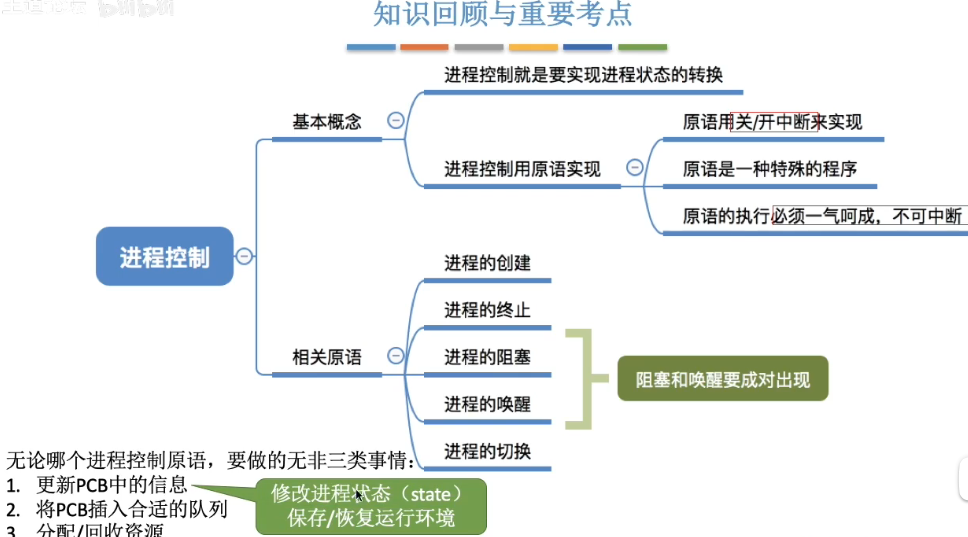
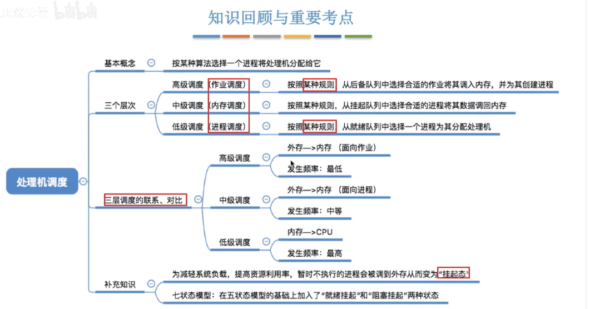
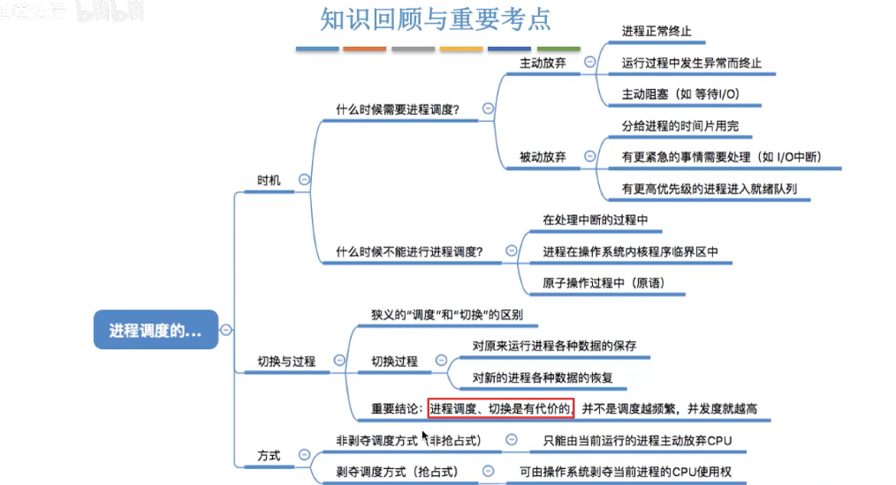
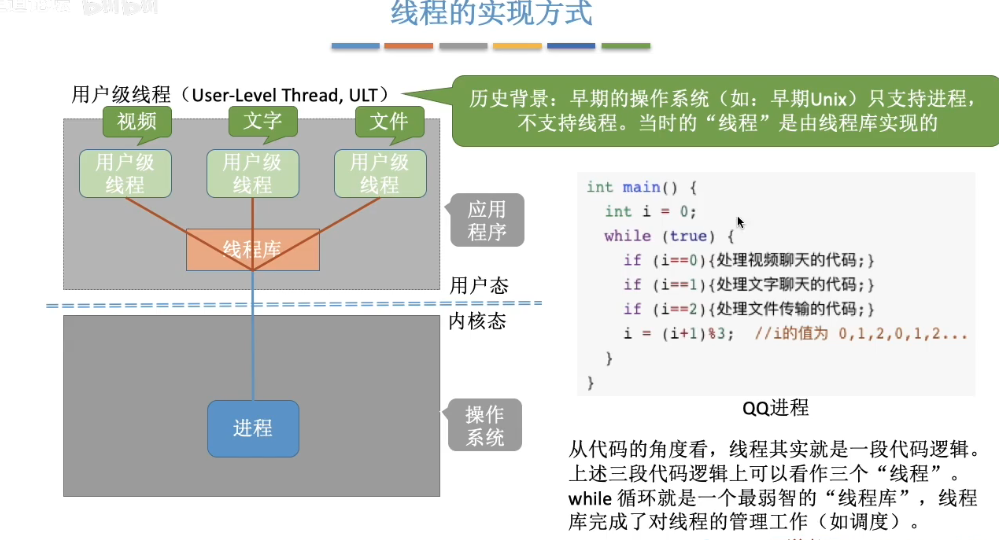
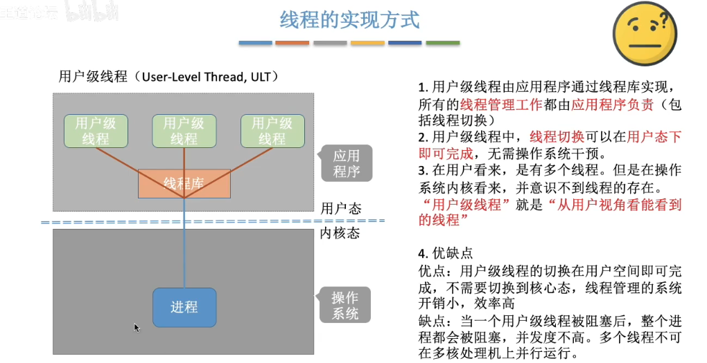
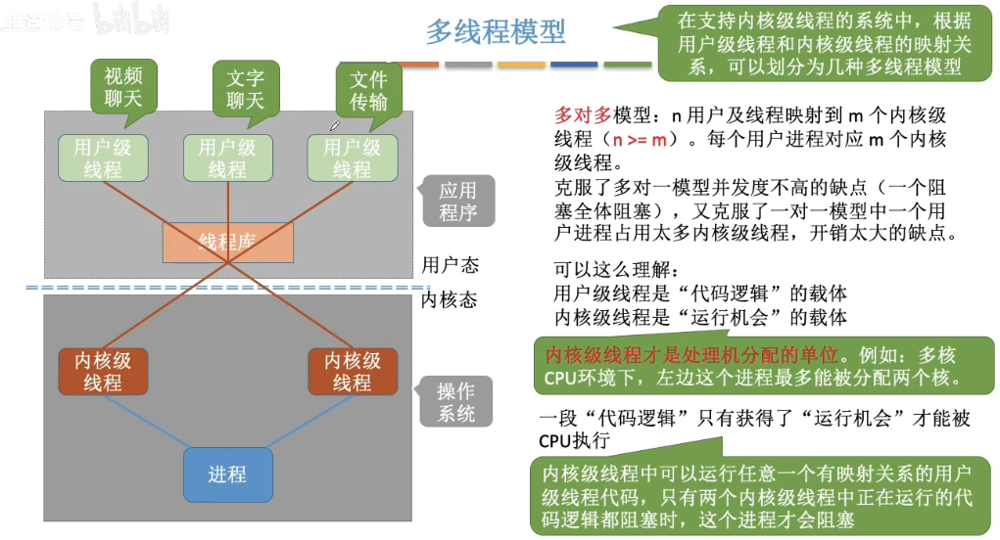
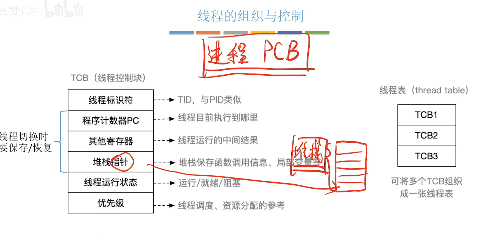

## 进程

### **进程的状态与切换，进程的组织**


- **创建态**是指进程刚被创建，但尚未进入就绪态，也没有资格被调度运行。==就是进程刚被创建，还没准备好资源的状态==
- 在创建态期间，操作系统需要完成以下工作：
  1. 为进程分配**进程控制块（PCB）**。
  2. 分配必要的资源（如内存空间、文件句柄、I/O设备等）。
  3. 初始化进程的运行环境（包括加载代码、数据到内存等）。


### **进程控制**



### **进程调度的概念，层次**



**后备队列**

此时程序会在外存的**后备 队列** 中等待，当**内存**空间足够时，这时**内存**会创建一个空白PCB，接着为进程分配资源，然后初始化PCB中的数据，最后将其插入**内存**的就绪队列中，等待CPU运行程序。 

### **进程调度的时机，切换与过程，方式**



### **调度器与闲逛进程**


### 临界资源和临界区

```
+----------------------+
|     栈 (Stack)        | <--- 存放局部变量、函数调用信息
+----------------------+
|     堆 (Heap)         | <--- 动态分配的内存区域
+----------------------+
|     BSS 段 (未初始化数据)  |
|     (未初始化全局变量)    |
+----------------------+
|     数据段 (已初始化数据) |
|     (已初始化全局变量)    |
+----------------------+
|     代码段 (Text Segment)|
|     (程序指令)          |
+----------------------+

```

**临界区指的是进程里面  那段访问临界资源的代码**

**进程**：进程是程序执行的实例，它有独立的地址空间和资源。每个进程都有自己独立的内存空间、文件描述符等。


## 线程 

**用户级线程**

用户级线程更像是一段代码逻辑，while循环就是一个线程库

**为什么被称为“伪的多线程”？**

**(1) 单核上无法实现真正并行**

- 单核CPU执行特点
  - 用户级线程的切换在同一个核上进行，本质上是时间片轮转，无法真正实现多线程的**并行执行**（只体现了并发性）。
  - 在内核看来，一个进程在运行时，即使有多个用户级线程，依然是单个CPU核心在执行一个线程的代码，其他线程处于等待状态。

**(2) 多核CPU的局限**

- 用户级线程并不直接映射到操作系统的内核线程（Kernel Threads）。因此，即使在多核系统上，操作系统也只会分配一个内核线程来执行整个用户进程。
- 多核系统的优势无法被用户级线程充分利用，因为只有一个内核线程在运行，其他核无法调度用户级线程。

**(3) 阻塞问题**

- 如果用户级线程发起了阻塞调用（例如 I/O 操作），整个进程会被挂起，导致所有用户级线程都无法继续运行。
- 这种行为与真正的多线程（每个线程独立调度和阻塞）不符，进一步限制了用户级线程的多线程特性。

**(4) 调度不可见性**

- 操作系统的调度器只能看到进程级别的状态，而无法感知用户级线程的调度和切换。这意味着操作系统无法对多个用户级线程进行优化调度，导致它们表现得不像“真正的多线程”。





**内核级线程**

内核级线程对操作系统才是可见的，是处理机分配的基本单位


**多线程模型**



**线程的组织与控制**



## 函数

### std::mutex

**1. `std::mutex` 相关函数**

`std::mutex::lock()`

- **作用**：获取互斥锁。如果锁被其他线程持有，当前线程会被阻塞，直到锁可用。

- 示例：

  ```cpp
  std::mutex mtx;
  mtx.lock(); // 获取锁
  ```

`std::mutex::unlock()`

- **作用**：释放互斥锁。使其他线程可以获取锁。

- 示例：

  ```cpp
  mtx.unlock(); // 释放锁
  ```

`std::lock_guard<std::mutex>`

- **作用**：RAII风格的锁管理工具类，用于自动获取和释放锁，避免手动管理。

- 示例：

  ```cpp
  std::lock_guard<std::mutex> lock(mtx); // 自动加锁和解锁
  ```

- `std::unique_lock<std::mutex>`

- **作用**：与 `lock_guard` 类似，但提供更多灵活性（如手动解锁、延迟锁等）。

- 示例：

  ```cpp
  std::unique_lock<std::mutex> lock(mtx); // 加锁
  lock.unlock(); // 手动解锁
  ```

### std::condition_variable

**2. `std::condition_variable` 相关函数**

`std::condition_variable::wait(std::unique_lock<std::mutex>& lock)`

- **作用**：让当前线程在条件变量上等待，并释放给定的互斥锁。等待直到被 `notify_one()` 或 `notify_all()` 唤醒，或者条件满足。

- 示例：

  ```cpp
  std::condition_variable cv;
  std::unique_lock<std::mutex> lock(mtx);
  cv.wait(lock); // 释放锁并等待通知
  ```

`std::condition_variable::wait(std::unique_lock<std::mutex>& lock, Predicate pred)`

- **作用**：等待条件满足。类似于上面的方法，但在等待时，会根据 `pred`（一个布尔表达式）检查条件是否满足，如果不满足则继续等待。

- 示例：

  ```cpp
  cv.wait(lock, [] { return !task_queue.empty(); }); // 等待任务队列不为空
  ```

`std::condition_variable::notify_one()`

- **作用**：通知一个等待在此条件变量上的线程，唤醒它继续执行。通常用于唤醒一个消费者线程或者工作线程。

- 示例：

  ```cpp
  cv.notify_one(); // 通知一个线程继续执行
  ```

`std::condition_variable::notify_all()`

- **作用**：通知所有等待在此条件变量上的线程，唤醒它们继续执行。通常用于当多个线程需要同时执行时。

- 示例：

  ```cpp
  cv.notify_all(); // 通知所有线程继续执行
  ```

**总结**

- `std::mutex`

   用于保护共享资源，确保在同一时间只有一个线程能访问资源。

  - `lock()`、`unlock()` 通过手动控制锁的获取和释放来保护临界区。
  - `std::lock_guard` 和 `std::unique_lock` 提供了更安全、更灵活的自动锁管理机制。

- `std::condition_variable`

   用于线程同步，通常在生产者-消费者模型等场景中使用。

  - `wait()` 会让线程进入等待状态，并释放锁，直到被其他线程唤醒。
  - `notify_one()` 和 `notify_all()` 用于唤醒一个或多个等待线程，继续执行。

### std::thread

在 C++ 中，创建线程时，`std::thread` 类提供了一个构造函数，允许你传递要在线程中执行的函数（或可调用对象）和相关参数。线程的参数包括以下几个关键点：

**1. 基本的 `std::thread` 构造函数**

```cpp
std::thread t1(func, arg1, arg2, ...);
```

- `func`：要在线程中执行的函数、函数对象或可调用对象。可以是：
  - 普通函数
  - 成员函数（需要指定对象实例）
  - Lambda 表达式
  - 函数对象
  - 可调用类对象
- `arg1, arg2, ...`：传递给 `func` 的参数。

**2. 参数传递的方式**

- **普通函数**：传递普通函数时，线程将接收函数指针以及相应的参数。

  **示例**：

  ```cpp
  void print_number(int n) {
      std::cout << "Number: " << n << std::endl;
  }
  
  int main() {
      std::thread t1(print_number, 42);  // 将 42 传递给 print_number 函数
      t1.join();  // 等待线程结束
      return 0;
  }
  ```

- **Lambda 表达式**：可以直接在 `std::thread` 构造函数中传递 Lambda 表达式作为线程执行的任务。

  **示例**：

  ```cpp
  int main() {
      std::thread t1([](int n) { 
          std::cout << "Number: " << n << std::endl;
      }, 42);  // Lambda 表达式接收参数 42
      t1.join();
      return 0;
  }
  ```

- **成员函数**：如果你传递的是一个成员函数，除了函数本身，还需要传递该成员函数所属类的实例对象。

  **示例**：

  ```cpp
  class Printer {
  public:
      void print_message(const std::string& msg) {
          std::cout << msg << std::endl;
      }
  };
  
  int main() {
      Printer printer;
      std::thread t1(&Printer::print_message, &printer, "Hello, World!");
      t1.join();  // 等待线程结束
      return 0;
  }
  ```

  这里，`&Printer::print_message` 是成员函数指针，`&printer` 是成员函数所属对象的指针。

- **函数对象（可调用对象）**：你还可以使用函数对象作为线程的执行任务。

  **示例**：

  ```cpp
  struct Printer {
      void operator()(const std::string& msg) {
          std::cout << msg << std::endl;
      }
  };
  
  int main() {
      Printer printer;
      std::thread t1(printer, "Hello from functor!");
      t1.join();
      return 0;
  }
  ```

**3. 线程的参数传递方式**

- 参数的传递方式由 **C++11** 引入的 `std::thread` 实现。当你传递参数给线程时，通常会通过 **值传递** 或 **引用传递**（借助 `std::ref`）来传递参数。

  - **值传递**：线程会接收到传递参数的拷贝。

    **示例**：

    ```cpp
    int main() {
        int x = 42;
        std::thread t1([](int n) { 
            std::cout << "Received: " << n << std::endl;
        }, x);  // 传递 x 的拷贝
        t1.join();
        return 0;
    }
    ```

  - **引用传递**：如果你希望线程函数能直接修改传入的变量，需要使用 `std::ref` 进行引用包装。

    **示例**：

    ```cpp
    int main() {
        int x = 42;
        std::thread t1([](int& n) { 
            n = 100;  // 修改 n 的值
        }, std::ref(x));  // 传递 x 的引用
        t1.join();
        std::cout << "x = " << x << std::endl;  // 输出 100
        return 0;
    }
    ```

    这里，`std::ref(x)` 确保 `x` 被以引用方式传递给线程。

**4. 线程参数传递的注意事项**

- **线程函数的生命周期**：当线程函数执行时，传入的参数会在 `std::thread` 对象的生命周期内保持有效。如果在线程对象销毁前，线程还没有执行完成，程序可能会出现未定义行为。
- **避免数据竞争**：如果线程共享某些资源，确保采用适当的同步机制（例如使用 `std::mutex`）来避免多个线程并发访问同一个资源时发生数据竞争。

**总结**

`std::thread` 的构造函数的参数包括：

- 要执行的函数或可调用对象（如函数指针、Lambda、成员函数、函数对象等）。
- 传递给线程函数的参数。

根据你的需求，可以选择不同类型的可调用对象和参数传递方式（值传递或引用传递）。

`std::this_thread::sleep_for` 和 `std::condition_variable::wait_for` 是两个不同的功能，它们用于不同的场景。下面是它们的区别和使用情况：

### std::this_thread::sleep_for

- **用途**：用于让当前线程暂停（休眠）一段指定的时间。

- **作用**：当前线程在调用 `sleep_for` 时会进入阻塞状态，直到指定的时间过去。它会消耗 CPU 时间，但并不会检查任何条件，只是简单地等待时间的流逝。

- **函数原型**：

  ```cpp
  void sleep_for(const std::chrono::duration<Rep, Period>& duration);
  ```

  其中 `duration` 是一个表示时间长度的对象，比如 `std::chrono::milliseconds(100)`。

- **示例用法**：

  ```cpp
  std::this_thread::sleep_for(std::chrono::seconds(2));  // 让当前线程休眠 2 秒
  ```

- **适用场景**：当你需要让当前线程等待一段固定的时间，但不关心是否满足某个条件时，使用 `sleep_for`。

在C语言中，`sleep` 和 `sleep_for` 主要用于让程序暂停一段时间，但它们的具体实现和语法有所不同。

1. **`sleep`**:

   - `sleep` 是一个 POSIX 标准的函数，通常用于 Unix-like 系统（如 Linux 和 macOS）。

   - 该函数接受一个参数，表示程序应该暂停的时间，单位是秒。

   - 示例代码：

     ```c
     #include <unistd.h>
     
     int main() {
         sleep(5);  // 暂停 5 秒
         return 0;
     }
     ```

   - 注意：`sleep` 函数返回时可能会因为信号中断而提前返回，但通常不会返回具体的中断信息。

2. **`sleep_for`**:

   - `sleep_for` 是 C++11 引入的标准库函数，属于 `<chrono>` 头文件，允许程序暂停指定的时间。`sleep_for` 可以更精确地指定暂停的时间，包括毫秒、微秒等单位。

   - 示例代码：

     ```cpp
     #include <chrono>
     #include <thread>
     
     int main() {
         std::this_thread::sleep_for(std::chrono::seconds(5));  // 暂停 5 秒
         return 0;
     }
     ```

   - `sleep_for` 更为灵活，因为你可以使用不同的时间单位，如秒（`std::chrono::seconds`）、毫秒（`std::chrono::milliseconds`）等。

总结：

- `sleep` 是 C 标准库函数，暂停时间单位是秒，适用于 POSIX 系统。
- `sleep_for` 是 C++ 标准库函数，可以提供更精确的时间控制，支持不同的时间单位，并且是 C++11 引入的。

如果你在编写 C 程序并且需要暂停，使用 `sleep`；而在 C++ 中，如果需要更精细的时间控制，可以使用 `sleep_for`。

### std::condition_variable::wait_for

- **用途**：用于使线程等待一段时间，直到条件变量通知它或者超时。

- **作用**：与 `std::condition_variable::wait` 类似，`wait_for` 会让当前线程等待，但它会在指定的时间后超时。如果在超时时间内没有接收到通知（通过 `notify_one` 或 `notify_all`），线程会自动返回。

- **函数原型**：

  ```cpp
  template< class Rep, class Period >
  std::cv_status wait_for( std::unique_lock<std::mutex>& lock,
                           const std::chrono::duration<Rep, Period>& rel_time );
  ```

  - `lock`：传入的锁，通常是 `std::unique_lock<std::mutex>`。
  - `rel_time`：超时时间，表示线程应等待多长时间。

- **返回值**：`wait_for` 返回一个 `std::cv_status` 枚举值，有两个可能的结果：

  - `std::cv_status::no_timeout`：表示线程因为接收到通知而退出等待。
  - `std::cv_status::timeout`：表示线程超时退出等待。

- **示例用法**：

  ```cpp
  std::unique_lock<std::mutex> lock(mtx);
  if (cv.wait_for(lock, std::chrono::seconds(2)) == std::cv_status::timeout) {
      std::cout << "Timeout occurred!" << std::endl;
  }
  ```

- **适用场景**：当你希望线程等待某个条件，并且在等待超时之前有可能会收到通知时，使用 `wait_for`。它适用于超时的场景。

**区别总结：**

| 特性         | `std::this_thread::sleep_for`        | `std::condition_variable::wait_for`              |
| ------------ | ------------------------------------ | ------------------------------------------------ |
| **目的**     | 让当前线程休眠指定的时间             | 让当前线程等待指定的时间，直到接收到通知或者超时 |
| **超时处理** | 不会处理超时，线程只是休眠固定时间   | 处理超时，等待指定时间后返回，并可以检测是否超时 |
| **阻塞条件** | 线程始终阻塞，直到时间过去           | 线程阻塞，直到满足条件或者超时                   |
| **常用场景** | 用于延时执行，或者让线程暂时停止工作 | 用于等待某个条件，或者在超时情况下避免无限期等待 |

何时使用 `sleep_for` 和 `wait_for`？

- 使用 `std::this_thread::sleep_for` 时：你希望让线程在不关心其他条件的情况下等待一段固定时间。这通常用于模拟延时、定时器等场景。
- 使用 `std::condition_variable::wait_for` 时：你希望线程等待一个条件（通常通过条件变量通知），并且可以在一定时间内超时退出。如果超时发生，线程可以继续执行，而不是无限期阻塞。

### std::chrono::

`std::chrono::milliseconds`、`std::chrono::seconds`、`std::chrono::microseconds` 和 `std::chrono::nanoseconds` 等类型是 `std::chrono::duration` 的特化版本（specializations），而不是继承关系。

`std::chrono::duration` 是一个模板类，定义了一个通用的时间间隔类型，接受两个模板参数：

1. **Rep**：表示时间量的基本类型（通常是整数类型，例如 `int`, `long`, `long long`, 或者 `std::chrono::duration` 本身等）。
2. **Period**：时间单位的比率，通常是一个 `std::ratio` 类型，用于表示时间单位（如秒、毫秒、微秒等）。

例如，`std::chrono::milliseconds` 是 `std::chrono::duration` 的特化版本，表示毫秒。在这个特化版本中，`Rep` 通常是 `long` 或 `int`，而 `Period` 是 `std::milli`，即 `1/1000`。

```cpp
namespace std::chrono {
    using milliseconds = duration<int64_t, milli>;
    using seconds = duration<int64_t>;
    using microseconds = duration<int64_t, micro>;
    using nanoseconds = duration<int64_t, nano>;
}
```

在这个定义中：

- `milliseconds` 是 `duration<int64_t, milli>`，表示千分之一秒（即1毫秒），
- `seconds` 是 `duration<int64_t, ratio<1>>`，表示秒，
- `microseconds` 是 `duration<int64_t, micro>`，表示百万分之一秒（即1微秒），
- `nanoseconds` 是 `duration<int64_t, nano>`，表示十亿分之一秒（即1纳秒）。

**总结：**

这些类型（`std::chrono::milliseconds`、`std::chrono::seconds`、`std::chrono::microseconds` 等）并不是通过继承实现的，而是 `std::chrono::duration` 的特化模板。它们通过指定不同的 `Period`（即时间单位的比率）来定义具体的时间单位。因此，它们本质上是 `duration` 的不同类型实例，而不是继承关系。

## 示例

```C++
std::mutex mtx;
std::queue<int> task_queue;
std::condition_variable cv;

void producer() {
    std::unique_lock<std::mutex> lock(mtx);
    task_queue.push(42);  // 添加任务
    cv.notify_one();  // 唤醒一个等待线程
}

void consumer() {
    std::unique_lock<std::mutex> lock(mtx);
    cv.wait(lock, [] { return !task_queue.empty(); });  // 等待任务出现
    int task = task_queue.front();  // 取任务
    task_queue.pop();
}

```

