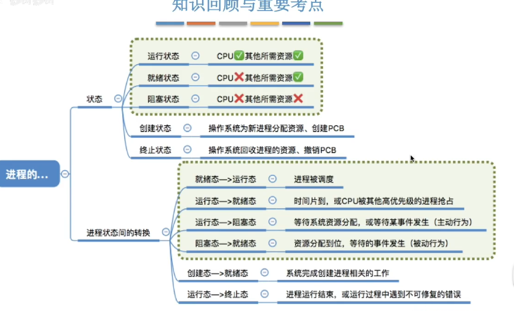
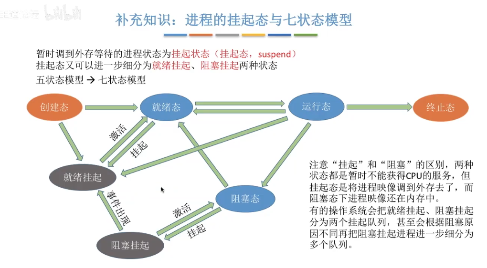
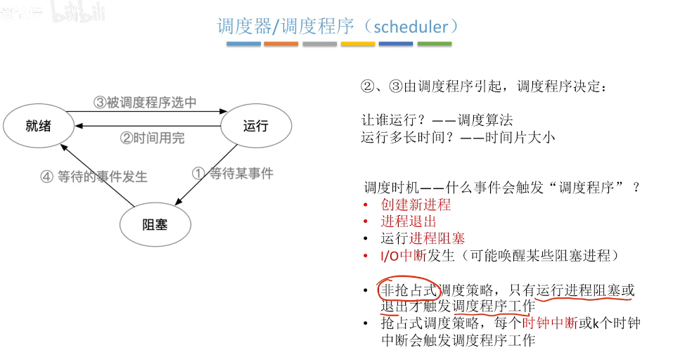
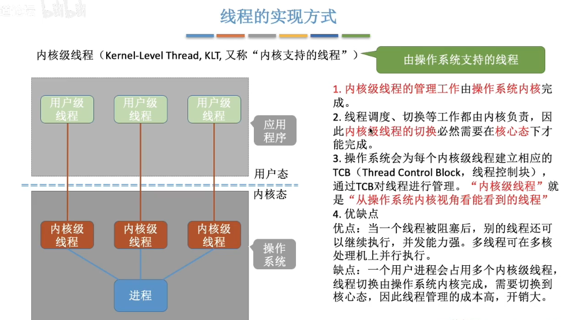

## 进程

### **进程的状态与切换，进程的组织**

- **创建态**是指进程刚被创建，但尚未进入就绪态，也没有资格被调度运行。==就是进程刚被创建，还没准备好资源的状态==
- 在创建态期间，操作系统需要完成以下工作：
  1. 为进程分配**进程控制块（PCB）**。
  2. 分配必要的资源（如内存空间、文件句柄、I/O设备等）。
  3. 初始化进程的运行环境（包括加载代码、数据到内存等）。

### **进程控制**

### **进程调度的概念，层次**

**后备队列**

此时程序会在外存的**后备 队列** 中等待，当**内存**空间足够时，这时**内存**会创建一个空白PCB，接着为进程分配资源，然后初始化PCB中的数据，最后将其插入**内存**的就绪队列中，等待CPU运行程序。 

### **进程调度的时机，切换与过程，方式**

### **调度器与闲逛进程**

### 临界资源和临界区

## 线程 

**用户级线程**

用户级线程更像是一段代码逻辑，while循环就是一个线程库

**为什么被称为“伪的多线程”？**

**(1) 单核上无法实现真正并行**

- 单核CPU执行特点
  - 用户级线程的切换在同一个核上进行，本质上是时间片轮转，无法真正实现多线程的**并行执行**（只体现了并发性）。
  - 在内核看来，一个进程在运行时，即使有多个用户级线程，依然是单个CPU核心在执行一个线程的代码，其他线程处于等待状态。

**(2) 多核CPU的局限**

- 用户级线程并不直接映射到操作系统的内核线程（Kernel Threads）。因此，即使在多核系统上，操作系统也只会分配一个内核线程来执行整个用户进程。
- 多核系统的优势无法被用户级线程充分利用，因为只有一个内核线程在运行，其他核无法调度用户级线程。

**(3) 阻塞问题**

- 如果用户级线程发起了阻塞调用（例如 I/O 操作），整个进程会被挂起，导致所有用户级线程都无法继续运行。
- 这种行为与真正的多线程（每个线程独立调度和阻塞）不符，进一步限制了用户级线程的多线程特性。

**(4) 调度不可见性**

- 操作系统的调度器只能看到进程级别的状态，而无法感知用户级线程的调度和切换。这意味着操作系统无法对多个用户级线程进行优化调度，导致它们表现得不像“真正的多线程”。

**内核级线程**

内核级线程对操作系统才是可见的，是处理机分配的基本单位

**多线程模型**

**线程的组织与控制**

