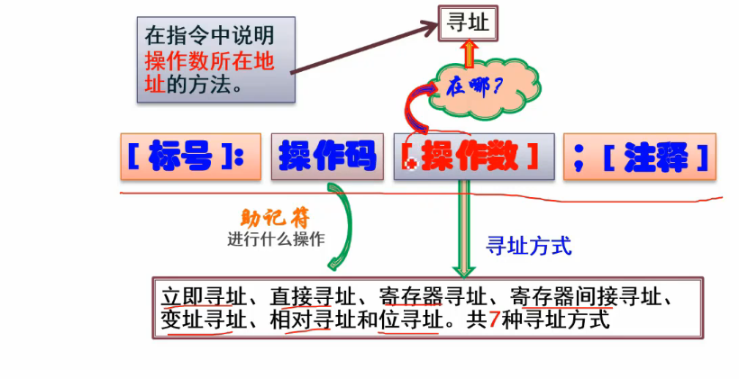
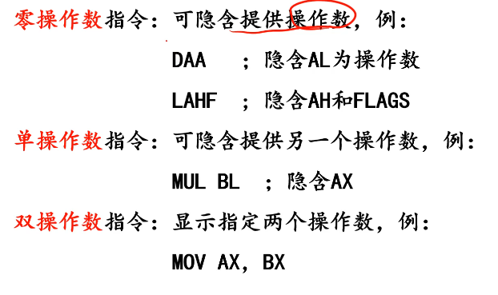

## C语言复试知识

## 复试的知识

### **面向对象比面向过程好在哪里**

- 视角不同: 面向对象编程更加关注对象本身和对象之间的关系，强调拆解问题，分而治之；而面向过程编程则更加注重解决问题的步骤和流程。
- 灵活性差异： 面向对象编程灵活度较高，能够适应变化和需求调整，对扩展和修改友好；而面向过程编程相对较为刚性，增加新功能可能需要修改多处代码，不太方便。
- 可维护性和可复用性： 面向对象编程有着良好的可维护性和可复用性，通过复用已有的对象和接口，可减少重复编写代码的工作量；而面向过程编程往往需要在每一处使用同样的代码，可维护性相对较低。

### **websocket**

WebSocket是一种在单个TCP连接上进行全双工通信的协议。WebSocket使得客户端和服务器之间的数据交换变得更加简单，允许服务端主动向客户端推送数据。在WebSocket API中，浏览器和服务器只需要完成一次握手，两者之间就直接可以创建持久性的连接，并进行双向数据传输。

**有一个服务端Server**

**众多客户端Client，众多客户端通过基于TCP的Websocket协议进行连接，客户端和服务器只需要完成一次握手，就能完成互相连接，类似于一个星型拓扑结构**

### YoloV5

YOLOv5的原理基于YOLO（You Only Look Once）系列的目标检测方法，它在一次前向传递中直接从图像中检测出目标边界框和类别概率。下面是YOLOv5的主要原理：**YOLOv5使用的主干网络通常是轻量级的卷积神经网络**

1. **单阶段检测**：YOLOv5是一种单阶段目标检测器，与传统的两阶段检测器（如Faster R-CNN）不同。传统的两阶段检测器通常分为区域提取和分类两个阶段，而YOLOv5将这两个阶段合并在一个单一的神经网络中。

2. **全图预测**：YOLOv5将整个图像作为输入，并使用卷积神经网络一次性处理整个图像，而不是对图像中的不同区域进行分别处理。这种全图预测的方法使得YOLOv5在处理速度上具有优势，适用于实时应用。

3. **Anchor Boxes和Grid Cells**：YOLOv5在图像上定义了一个网格，并在每个网格单元中预测多个边界框。每个边界框都与预定义的一组锚点框（anchor boxes）相关联，这些锚点框可以覆盖不同尺度和长宽比的目标。这种设计使得模型能够检测各种不同尺度和形状的目标。

4. **多尺度预测**：YOLOv5通常会使用多个尺度的特征图来进行目标检测，以便在不同分辨率下检测目标。通过使用不同层级的特征图来预测边界框，YOLOv5可以提高对小目标和远距离目标的检测能力。

5. **损失函数**：YOLOv5使用一种组合损失函数来衡量模型的预测与真实标签之间的差异。这个损失函数通常包括目标位置的平滑L1损失、目标类别的交叉熵损失以及一些正则化项。通过优化这个损失函数，模型可以学习到更准确的目标检测。

6. **后处理**：在预测阶段，YOLOv5会应用一些后处理技术来过滤和合并检测结果，以提高检测的准确性和稳定性。其中最常用的技术是非极大值抑制（NMS），用于去除重叠较多的边界框，保留置信度最高的边界框。

综上所述，YOLOv5通过使用单一的神经网络结构，全图预测目标，结合Anchor Boxes和Grid Cells的设计以及多尺度预测，实现了快速而准确的目标检测。

**YOLOV5的输入端会以图片形式进行输入->Mosaic(mouzik)算法进行数据增强->自适应锚框计算（在初始化锚框的基础上进行预测，与真实的初始化设定的锚框进行对比两者差异，再反向更新参数）**

普通的目标检测是分成区域提取和分类两个阶段，而YOLOv5将这两个阶段合并在一个单一的神经网络中。

YOLOv5将整个图像作为输入，并使用卷积神经网络一次性处理整个图像，而不是对图像中的不同区域进行分别处理。这种全图预测的方法使得YOLOv5在处理速度上具有优势，适用于实时应用。**(rcnn也可以进行目标检测)**

### LPRNET

**网络结构**：

- LPRNet通常由两部分组成：特征提取器和字符识别器。
- 特征提取器通常是一个卷积神经网络（CNN），用于从输入图像中提取出有用的特征信息。这些特征信息可以包括车牌的边界、文本轮廓、字符形状等。
- 字符识别器则用于将提取到的特征映射到字符类别。通常是一个循环神经网络（RNN）或者全连接层，用于逐个字符地预测车牌上的文本。

⑴ LPRNet不需要字符预先分割，车牌识别的准确率高、算法实时性强、支持可变长字符车牌识别。对于字符差异比较大的各国不同车牌均能够**端到端**进行训练。

⑵ LPRNet是第一个没使用RNN的实时轻量级算法，能够在包括嵌入式设备在内的各式设备上运行。

⑶ LPRNet在实际交通监控视频中的应用表明，该算法在视角和摄像畸变、光照条件恶劣、视角变化等复杂的情况下仍表现出很好的识别效果。

**算法分成两步，第一步是特征提取，本质上是使用了一个卷积神经网络**

**在最后一步的时候使用一维卷积核对特征提取代替了RNN把三维数据转化成二维数据，其中一维就是时间序列，另一个维度就是每个时间段我们需要预测的字符，产生序列化的数据**

**最后使用CTC算法进行文字识别（CTC算法是识别序列化数据）**

### nginx负载均衡

web服务器，包括nginx apache tomcat 这些

### tcp三次握手和websocket一次连接

### **计算机系统结构---寻址方式**

**通用寄存器**

- **AX，BX，CX，DX**称作为数据寄存器：

AX (Accumulator)：累加寄存器，也称之为累加器；

BX (Base)：基地址寄存器；

CX (Count)：计数器寄存器；

DX (Data)：数据寄存器；

- **SP**和**BP**又称作为指针寄存器：

SP (Stack Pointer)：堆栈指针寄存器；

BP (Base Pointer)：基指针寄存器；

- **SI**和**DI**又称作为变址寄存器：

SI (Source Index)：源变址寄存器；

DI (Destination Index)：目的变址寄存器；

**控制寄存器：**

IP (Instruction Pointer)：指令指针寄存器；

FLAG：标志寄存器；

**段寄存器：**

CS (Code Segment)：代码段寄存器；

DS (Data Segment)：数据段寄存器；

SS (Stack Segment)：堆栈段寄存器；

ES (Extra Segment)：附加段寄存器；

### **计算机系统结构---指令格式**

**指令格式和指令长度**

**指令类型**

### bert和rnn再复习一下

batch_size  epoch  batch
