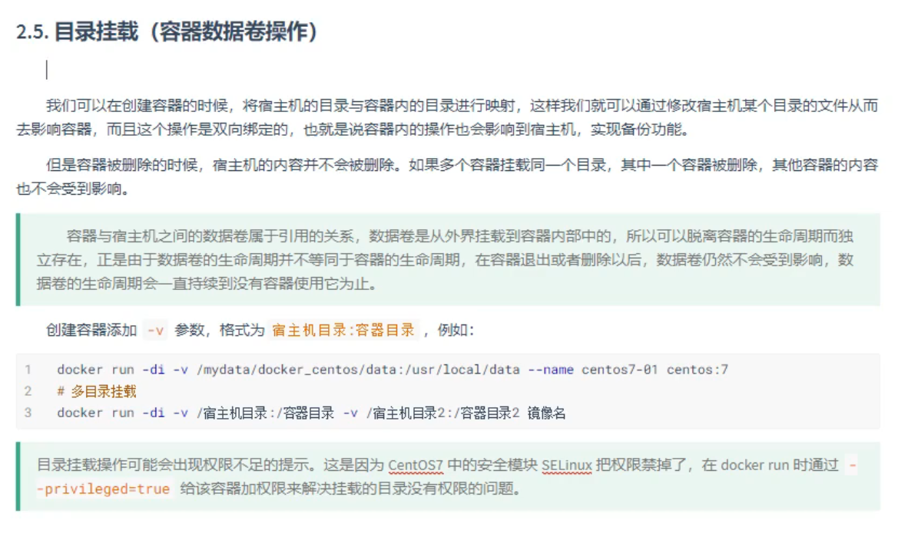

# Docker

## Docker

Docker 是一个开源的应用容器引擎，基于Go语言并遵从 Apache2.0 协议开源。

Docker 可以让开发者打包他们的应用以及依赖包到一个轻量级、可移植的容器中，然后发布到任何流行的 Linux 机器上，也可以实现虚拟化。

容器是完全使用沙箱机制，相互之间不会有任何接口，更重要的是容器性能开销极低。

## Docker映射端口

每一个 Docker 容器都可以有独立的端口，可以通过映射 Docker 容器的端口到主机的端口来让外部访问容器内部的服务。

在运行容器时，可以使用 `-p` 参数将容器的端口映射到主机的端口。例如，下面的命令将容器的 80 端口映射到主机的 8080 端口：

```shell
docker run -p 8080:80 nginx
```

这个命令将会启动一个 Nginx 容器，并将容器的 80 端口映射到主机的 8080 端口上。这样，外部访问主机的 8080 端口就相当于访问了容器的 80 端口，可以访问容器内部的 Nginx 服务了。

在使用多个容器时，不同容器的端口可以相同，因为每个容器都是相互隔离的独立环境。同一台主机上不同的容器可以使用相同的端口号，只要每个容器在映射端口时将主机的端口映射到不同的端口即可。

例如，我们可以启动两个使用相同端口的 Nginx 容器，然后将它们映射到不同的主机端口，示例命令如下：

```
docker run -d --name nginx1 -p 8080:80 nginx
docker run -d --name nginx2 -p 8081:80 nginx
```

在这个示例中，我们启动了两个 Nginx 容器，并将它们的 80 端口分别映射到了主机的 8080 和 8081 端口上，这样我们就可以通过访问主机的 8080 端口和 8081 端口来分别访问这两个容器的 Nginx 服务。

需要注意的是，如果多个容器使用相同的端口号并且映射到相同的主机端口，那么只有一个容器能够成功启动，因为同一主机端口只能被一个进程占用。因此，在使用相同端口的容器时，需要将它们映射到不同的主机端口上以避免端口冲突。

## Docker镜像

镜像相关命令

- `docker images`：列出本地的镜像列表
- `docker pull`：从仓库中下载指定的镜像
- `docker push`：将本地的镜像推送到仓库中
- `docker build`：从 Dockerfile 构建镜像
- `docker rmi`：删除本地的镜像
- `docker tag`：为镜像打标签

使用repository:tag或者imageId标识镜像

### 删除镜像

删除 Docker 镜像时，如果这个镜像是某个正在运行的容器的基础镜像，那么在删除该镜像时会出现错误提示。但是，如果你强制删除该镜像，那么这个基于该镜像运行的容器会停止并且被删除，这可能会导致一些不可预料的损失，请谨慎操作。

因此，在删除镜像之前，建议先停止所有基于该镜像运行的容器，然后再删除该镜像。可以使用 `docker ps` 命令查看正在运行的容器列表，使用 `docker stop` 命令停止容器，然后再使用 `docker rm` 命令删除容器。完成这些操作之后，再使用 `docker rmi` 命令删除镜像，这样就能确保镜像被安全地删除，不会影响其他容器的运行。

要删除已经安装的 Docker 镜像，可以使用 `docker rmi` 命令。

**具体操作步骤如下：**

1. 使用 `docker images` 命令查看当前已经安装的 Docker 镜像，并记录需要删除的镜像的 `REPOSITORY` 和 `TAG` 信息。

2. 使用 `docker rmi` 命令删除指定的 Docker 镜像，命令格式为：

   ```shell
   docker rmi [OPTIONS] IMAGE [IMAGE...]
   ```

   其中，`IMAGE` 是需要删除的 Docker 镜像的 `REPOSITORY` 和 `TAG` 信息。

   例如，如果要删除名为 `myimage`，版本号为 `v1` 的 Docker 镜像，可以使用以下命令：

   ```shell
   docker rmi myimage:v1
   ```

   如果要删除所有的 Docker 镜像，可以使用以下命令：

   ```shell
   docker rmi $(docker images -q)
   ```

   该命令会使用 `docker images -q` 命令列出所有已安装的 Docker 镜像的 ID，然后将其作为参数传递给 `docker rmi` 命令，实现一次性删除所有镜像的目的。

注意，删除 Docker 镜像后将无法恢复，因此请谨慎操作。

## Docker容器

容器相关命令：

- `docker ps`：列出当前正在运行的容器
- `docker run`：**创建并运行**一个容器
- `docker start`：启动一个已经创建的容器
- `docker stop`：停止一个正在运行的容器
- `docker restart`：重启一个正在运行的容器
- `docker rm`：删除一个已经停止的容器
- `docker exec`：在运行中的容器中执行命令
- `docker attach`：连接到正在运行的容器中
- `docker logs`：查看容器的日志
- `exit`：退出容器

使用containerId唯一标识容器

### 创建Docker

1. 在执行docker run命令运行容器时，如果运行的镜像在本地没有找到，那么就会去Docker Hub中拉取镜像到本地中。命令如下：

   ```
   docker run ubuntu
   ```

   如果本地没有ubuntu:latest镜像，就会去Docker Hub中拉取镜像


2. docker pull：除了上面运行容器时去下载镜像，我们还可以主动去Docker Hub仓库中拉取镜像。命令如下：

   ```
   docker pull ubuntu
   ```

   **在默认的情况下，**docker run和docker pull在下载镜像的时候，如果没有指定镜像的标签，那么**默认下载的是标签为“latest”的镜像**。

### 进入运行的容器

``` shell
docker exec -it containerID '命令'
```

**-it 指：-i为交互式操作，-t为终端**

命令是指你在进入容器后执行什么命令

```
root@iZbp13dziilg8ifa6765zlZ:~/docker# docker exec -it 46 echo "hello"
hello
root@iZbp13dziilg8ifa6765zlZ:~/docker# 
```

可以发现如果不写bash的话就算写了-it的参数还是无法进入容器的控制台的。

### Docker run

#### docker run -d

`docker run -d` 命令表示以“后台运行”的方式启动容器。具体来说，`-d` 参数将 Docker 容器运行在“守护进程”模式下，也就是在后台运行，而不是在前台终端运行。这样可以让容器在后台运行，并不占用当前终端的控制权，而且在终端退出时也不会停止容器。

在使用 `-d` 参数启动容器时，可以通过 `docker logs` 命令查看容器的输出信息，例如：

```shell
docker logs <container-id>
```

其中 `<container-id>` 是容器的 ID，可以通过 `docker ps` 命令查看当前正在运行的容器的 ID。

需要注意的是，使用 `-d` 参数启动容器时，需要确保容器在后台运行时仍然能够正常工作，例如应该正确配置容器的端口映射、数据卷等设置，以确保容器可以正常提供服务。

#### docker run -e

`docker run -e` 命令可以向 Docker 容器中设置环境变量。具体来说，`-e` 参数后面可以跟一个或多个环境变量的键值对，用来指定容器内的环境变量。

例如，下面的命令将在容器内设置一个名为 `MY_VAR` 的环境变量，值为 `my_value`：

```shell
docker run -e MY_VAR=my_value <image>
```

在容器内，可以通过 `echo $MY_VAR` 命令查看这个环境变量的值。

需要注意的是，容器内的环境变量是在容器运行时设置的，而不是在容器构建时设置的。因此，如果需要在构建镜像时设置环境变量，可以在 Dockerfile 中使用 `ENV` 命令，例如：

```
ENV MY_VAR=my_value
```

这样，构建出的镜像中就会包含一个名为 `MY_VAR` 的环境变量，值为 `my_value`。

#### docker run -it

`docker run -it` 命令表示以“交互式终端”的方式启动容器。具体来说，`-it` 参数表示同时启用容器的标准输入（stdin）和标准输出（stdout），并以“交互模式”启动容器，在终端中与容器进行交互。

例如，下面的命令会启动一个 Ubuntu 20.04 的容器，并在终端中与容器交互：

```shell
docker run -it ubuntu:20.04
```

在这个容器中，可以执行各种命令，例如 `ls`、`pwd` 等。在交互模式下，可以通过按下 `Ctrl + D` 来退出容器并停止容器的运行。如果需要在容器内运行后台进程，可以使用 `-d` 参数将容器切换到“后台运行”模式。

需要注意的是，使用 `-it` 参数启动容器时，需要在容器中安装终端或 shell 环境，以便在容器内进行交互。在大多数情况下，容器镜像中都已经包含了适当的终端或 shell 环境，例如 Ubuntu 镜像中包含了 Bash shell，因此可以直接使用 `-it` 参数启动容器。

bash是linux最常见的shell，可以直接在bash中运行.sh后缀的命令。和cmd直接运行.bash后缀命令相似

### Docker Hello World

Docker 允许你在容器内运行应用程序， 使用 **docker run** 命令来在容器内运行一个应用程序。

输出Hello world

```
$ docker run ubuntu:15.10 /bin/echo "Hello world"
Hello world
```

各个参数解析：

- **docker:** Docker 的二进制执行文件。
- **run:** 与前面的 docker 组合来运行一个容器。
- **ubuntu:15.10** 指定要运行的镜像，Docker 首先从本地主机上查找镜像是否存在，如果不存在，Docker 就会从镜像仓库 Docker Hub 下载公共镜像。
- **/bin/echo "Hello world":** 在启动的容器里执行的命令

以上命令完整的意思可以解释为：Docker 以 ubuntu15.10 镜像创建一个新容器，然后在容器里执行 bin/echo "Hello world"，然后输出结果。

## 发布Docker镜像

要将自己本地创建的Docker镜像发布到公共或私有的Docker仓库中，可以按照以下步骤进行操作：

**创建一个Docker镜像**

使用Dockerfile定义镜像的构建过程，构建镜像并为其指定一个标签。例如，假设有一个简单的Node.js应用程序，可以使用以下Dockerfile创建镜像：

```
FROM node:14
WORKDIR /app
COPY package*.json ./
RUN npm install
COPY . .
EXPOSE 3000
CMD ["npm", "start"]
```

在该Dockerfile所在的目录下，执行以下命令来构建Docker镜像：

```
docker build -t your-repo-name/your-image-name:tag .
```

其中，your-repo-name是你的Docker仓库名称（如果要上传到公共Docker Hub仓库，则为你的Docker Hub用户名），your-image-name是你的镜像名称，tag是你的镜像版本标签。

**登录到Docker仓库**

如果你要上传到公共Docker Hub仓库，可以使用以下命令登录：

```
docker login
```

如果你要上传到私有仓库，则需要使用相应的仓库登录命令进行登录。

**上传镜像**

使用以下命令将镜像上传到Docker仓库：

```
docker push your-repo-name/your-image-name:tag
```

如果上传到公共Docker Hub仓库，则不需要指定your-repo-name。

**拉取镜像**

其他人可以使用以下命令从Docker仓库中拉取你上传的镜像：

```
docker pull your-repo-name/your-image-name:tag
```

其中，your-repo-name、your-image-name和tag应该与你上传的镜像名称和版本标签相同。

这样，你就可以将自己本地创建的Docker镜像上传到Docker仓库中，并与其他人共享和使用了。

## 镜像和安装包的区别

镜像和安装包是软件分发的两种常见形式。

镜像（Image）是一个包含完整文件系统的只读文件，它是一个静态的快照，包括了操作系统、预装的软件和配置文件等完整的系统文件集合。在计算机领域中，镜像通常指的是完整的操作系统镜像或虚拟机镜像等。镜像是一个完整的操作系统或应用程序的副本，包含所有的文件、设置和配置，可以直接使用。通常情况下，镜像是以一个压缩包的形式进行分发，可以通过镜像工具将其写入到可引导的介质（如光盘、USB等）上进行安装。镜像的好处是可以快速、方便地部署系统或应用程序，并且可以保证部署的一致性。

安装包是一种用于安装软件的文件，它通常包含一个程序的所有文件和必要的安装信息，例如注册表项、库、配置文件等。安装包可以通过双击运行或者命令行运行，按照预定的步骤来完成软件的安装过程。安装包的好处是可以根据需要自定义软件的安装选项，例如选择安装路径、选择安装的组件等，从而满足用户的不同需求。

总的来说，镜像适合用于**批量部署相同的操作系统或应用程序**，而安装包适合用于为单个计算机安装特定的软件，并允许对软件进行定制化安装。

**为什么叫镜像站而不叫软件站**

“镜像站”这个术语的起源与它提供的服务有关。在早期的互联网上，由于网络带宽和主机性能等限制，许多流行的开源软件站点（如Linux操作系统、Apache Web服务器、MySQL数据库等）无法承受所有用户的下载请求，导致访问困难、下载缓慢等问题。为了解决这个问题，一些志愿者或组织会在各地建立自己的镜像站，复制官方站点的内容，并在本地提供相应的服务。这些镜像站的资源可以让用户更方便地获取软件、文件等资源，同时也可以减轻官方站点的压力。

因此，“镜像站”这个术语通常指的是提供软件、文件等资源的服务器，这些服务器会复制官方站点的内容，并提供同步更新的服务。尽管这些站点主要提供的是软件资源，但术语“镜像站”更准确地描述了它们的主要功能：复制官方站点内容，提供同步更新，让用户可以更快地获取软件和文件等资源。因此，即使镜像站提供的资源是软件，它们仍然被称为“镜像站”，而不是“软件站”。

## docker文件拷贝

 

## docker的数据卷

我们可以在创建容器的时候，将宿主机的目录与容器内的目录进行映射，这样我们就可以通过修改宿主机某个目录的文件从而去影响容器，而且这个操作是双向绑定的，也就是说容器内的操作也会影响到宿主机，实现备份功能。但是容器被删除的时候，宿主机的内容并不会被删除。如果多个容器挂载同一个目录，其中一个容器被删除，其他容器的内容也不会受到影响。

容器与宿主机之间的数据卷属于引用的关系，数据卷是从外界挂载到容器内部中的，所以可以脱离容器的生命周期而独立存在，正是由于数据卷的生命周期并不等同于容器的生命周期，在容器退出或者删除以后，数据卷仍然不会受到影响

容器与宿主机之间的数据卷属于引用的关系，数据卷是从外界挂载到容器内部中的，所以可以脱离容器的生命周期而独立存在，正是由于数据卷的生命周期并不等同于容器的生命周期，在容器退出或者删除以后，数据卷仍然不会受到影响。数据卷的生命周期会一直持续到没有容器使用它为止。



在使用 Docker 时，`docker-compose` 和 `docker` 命令有明显的区别，各自适用于不同的场景。让我们逐一分析它们的不同点，以及 `docker -it` 和 `docker -di` 的区别。

### 1. docker-compose与 docker 命令的区别

- **`docker` 命令**
  - Docker 是一个容器化工具，`docker` 命令允许你直接管理和操作容器、镜像、网络等资源。
  - 主要用于：
    - 创建和管理单个容器。
    - 拉取镜像、运行容器、查看日志等常见的 Docker 操作。
    - `docker run`、`docker ps`、`docker build` 等命令都是 Docker 原生命令。

- **`docker-compose`**
  - `docker-compose` 是一个用于定义和运行多容器 Docker 应用的工具，特别适合管理依赖关系复杂的服务（例如需要多个容器一起工作）。
  - 主要用于：
    - 通过 YAML 文件（通常是 `docker-compose.yml`）来定义多个服务的配置，包含镜像、端口映射、环境变量、网络等。
    - 可以轻松地启动、停止和管理多个容器。
    - 例如，`docker-compose up` 一条命令就可以启动所有在 `docker-compose.yml` 中定义的容器。

  **总结**：`docker` 适合单容器的管理操作，而 `docker-compose` 则更适合管理多个相关的服务容器，并提供了一种声明式的方式去组织和协调它们。

### 2. docker -it 和 docker -di 的区别

- **docker -it**
  
  - `-i`：表示以交互模式启动容器，保持标准输入（stdin）打开，这样你可以与容器中的进程交互。
  - `-t`：表示分配一个伪终端（pseudo-TTY），让你可以使用像命令行终端一样的方式与容器交互。
  - 组合使用 `-it`：通常用于需要与容器进行交互的场景，例如你想在容器中启动一个 shell 来执行命令。
    - 常见用法：`docker run -it ubuntu /bin/bash`，这样你可以进入 Ubuntu 容器并使用命令行。
  
- **docker -di**
  
  - `-d`：表示以后台（detached）模式启动容器，即容器启动后不会将终端挂起，而是直接在后台运行。
  - `-i`：保持标准输入（stdin）打开，但容器在后台运行。
  - 组合使用 `-di`：适用于希望后台运行容器但仍保留交互输入流的情况。通常这种用法比较少见，因为如果需要后台运行容器，标准输入通常也不需要保持打开。
    - 常见用法：`docker run -di ubuntu`，这样可以在后台启动一个 Ubuntu 容器。
  
  **总结**：
  - `-it` 是交互模式，一般用于进入容器并执行命令。
  - `-di` 是后台模式，但标准输入仍保持打开，虽然这类用法较少，通常后台运行时会关闭输入流。

这些命令的不同之处主要体现在如何启动容器、是否在前台/后台运行以及是否允许与容器进行交互。
