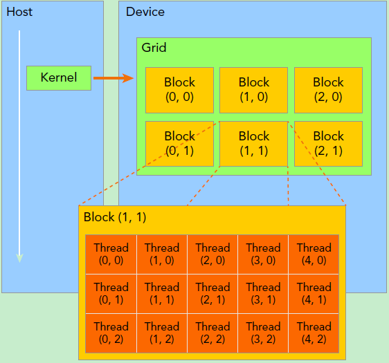

## CUDA编程模型基础

在给出CUDA的编程实例之前，这里先对CUDA编程模型中的一些概念及基础知识做个简单介绍。CUDA编程模型是一个异构模型，需要CPU和GPU协同工作。在CUDA中，**host**和**device**是两个重要的概念，我们用host指代CPU及其内存，而用device指代GPU及其内存。CUDA程序中既包含host程序，又包含device程序，它们分别在CPU和GPU上运行。同时，host与device之间可以进行通信，这样它们之间可以进行数据拷贝。典型的CUDA程序的执行流程如下：

1. 分配host内存，并进行数据初始化；
2. 分配device内存，并从host将数据拷贝到device上；
3. 调用CUDA的[核函数](https://zhida.zhihu.com/search?content_id=6024941&content_type=Article&match_order=1&q=核函数&zhida_source=entity)在device上完成指定的运算；
4. 将device上的运算结果拷贝到host上；
5. 释放device和host上分配的内存。

上面流程中最重要的一个过程是调用CUDA的核函数来执行并行计算，[kernel](https://link.zhihu.com/?target=http%3A//docs.nvidia.com/cuda/cuda-c-programming-guide/index.html%23kernels)是CUDA中一个重要的概念，kernel是在device上线程中并行执行的函数，核函数用`__global__`符号声明，在调用时需要用`<<<grid, block>>>`来指定kernel要执行的线程数量，在CUDA中，每一个线程都要执行核函数，并且每个线程会分配一个唯一的线程号thread ID，这个ID值可以通过核函数的内置变量`threadIdx`来获得。

由于GPU实际上是异构模型，所以需要区分host和device上的代码，在CUDA中是通过函数类型限定词开区别host和device上的函数，主要的三个函数类型限定词如下：

- `__global__`：在device上执行，从host中调用（一些特定的GPU也可以从device上调用），返回类型必须是`void`，不支持可变参数，不能成为类成员函数。注意用`__global__`定义的kernel是异步的，这意味着host不会等待kernel执行完就执行下一步。
- `__device__`：在device上执行，仅可以从device中调用，不可以和`__global__`同时用。
- `__host__`：在host上执行，仅可以从host上调用，一般省略不写，不可以和`__global__`同时用，但可和`__device__`，此时函数会在device和host都编译。

要深刻理解kernel，必须要对kernel的线程层次结构有一个清晰的认识。首先GPU上很多并行化的轻量级线程。kernel在device上执行时实际上是启动很多线程，一个kernel所启动的所有线程称为一个**网格**（grid），同一个网格上的线程共享相同的全局内存空间，grid是线程结构的第一层次，而网格又可以分为很多**线程块**（block），一个线程块里面包含很多线程，这是第二个层次。线程两层组织结构如下图所示，这是一个gird和block均为2-dim的线程组织。grid和block都是定义为`dim3`类型的变量，`dim3`可以看成是包含三个无符号整数（x，y，z）成员的结构体变量，在定义时，缺省值初始化为1。因此grid和block可以灵活地定义为1-dim，2-dim以及3-dim结构，对于图中结构（主要水平方向为x轴），定义的grid和block如下所示，kernel在调用时也必须通过执行配置`<<<grid, block>>>`来指定kernel所使用的线程数及结构。\

```c
dim3 grid(3, 2);
dim3 block(5, 3);
kernel_fun<<< grid, block >>>(prams...);
```



所以，一个线程需要两个内置的坐标变量（blockIdx，threadIdx）来唯一标识，它们都是`dim3`类型变量，其中blockIdx指明线程所在grid中的位置，而threaIdx指明线程所在block中的位置，如图中的Thread (1,1)满足：

```text
threadIdx.x = 1
threadIdx.y = 1
blockIdx.x = 1
blockIdx.y = 1
```