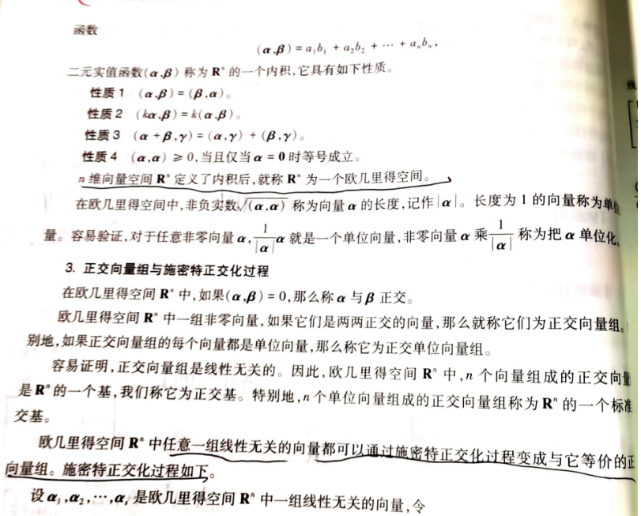
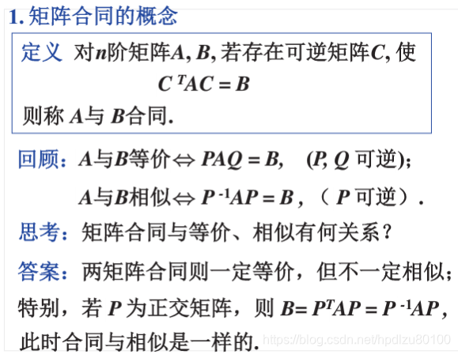

# 线性代数-向量空间

## 向量空间

以R^2^空间为例，如果有两个指向不同方向的非零向量a和b，那么R^2^空间的所有向量都可以用a和b的线性组合得出；a和b的所有线性组合都在R^2^空间内。这也意味着，向量空间对向量的所有线性组合封闭。下面是一个不封闭的例子，如果定义R^2^的第一象限是向量a(1,1)的向量空间，那么a的所有线性组合应该全部在第一象限内，但是 –a却落在了其它象限，所以第一象限不对a封闭，也不是a的向量空间。

因此，假设我们尝试定义“**第一象限中的向量构成的向量空间**”，这是不符合向量空间的定义的，因为向量空间必须对标量乘法和加法封闭。第一象限的向量空间在面对负数倍时就不再封闭，所以它并不构成一个合法的向量空间。 换句话说，如果我们定义 $ \mathbf{a} = (1, 1) $ 所在的向量空间，它的所有线性组合会填满整个 $\mathbb{R}^2$平面，而不仅仅是局限在第一象限。这表明第一象限中的向量无法构成一个完整的向量空间。

## 向量空间的基和维数

- ==空间才有基和维数的概念==
- 向量组的秩是极大线性无关组的个数，记作r(a~1~,a~2~,a~3~...a~n~)
- ==矩阵中行向量组的秩和列向量组的秩相等，统称为向量组的秩==

基就是张成子空间所需要的最小向量集。

　　如果一个向量集S={v~1~, v~2~ … v~n~}中的向量是线性无关的，S张成了一个子空间V，S就叫做V的一组基，{v~1~, 2v~2~, 3v~3~ … nv~n~} 是另一组基，但是它和第一组没什么本质区别。

　　下面的集合S~1~和S~2~都是R^2^的一组基：

 

　　因为S~2~中的两个向量是R^2^空间两个维度上的单位向量，所以S~2~也叫做R^2^的标准基。

## 欧几里得空间

## 矩阵等价，相似，合同

一、矩阵等价、相似和合同之间的区别：

1、等价，相似和合同三者都是等价关系。

2、矩阵相似或合同必等价，反之不一定成立。

3、矩阵等价，只需满足两矩阵之间可以通过一系列可逆变换，也即若干可逆矩阵相乘得到。

4、矩阵相似，则存在可逆矩阵P使得，B=P^-1^AP。

5、矩阵合同，则存在可逆矩阵P使得，B=P^T^AP。

6、当上述矩阵P是正交矩阵时，即P^T^=P^-1^，则有A，B之间既满足相似，又满足合同关系。

二、矩阵等价、相似、合同之间联系：

1、矩阵等秩是相似、合同、等价的必要条件，相似、合同、等价是等秩的充分条件。

2、矩阵等价是相似、合同的必要条件，相似、合同是等价的充分条件。

3、 矩阵相似、合同之间没有充要关系，存在相似但不合同的矩阵，也存在合同但不相似的矩阵。

4、总结起来就是：相似=>等价，合同=>等价，等价=>等秩。

