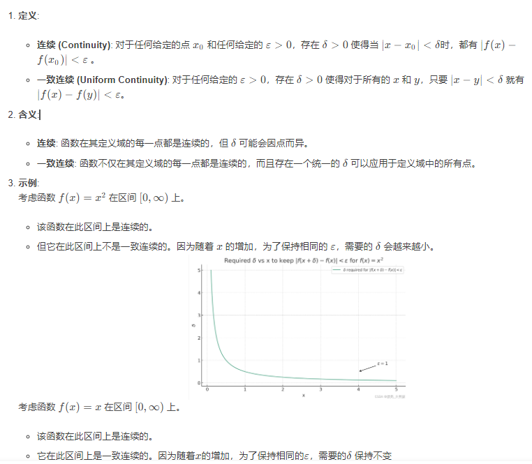
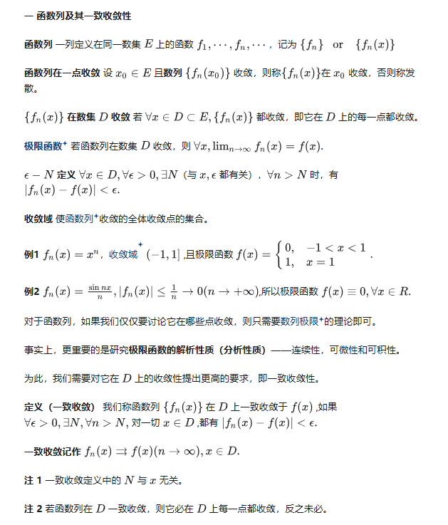
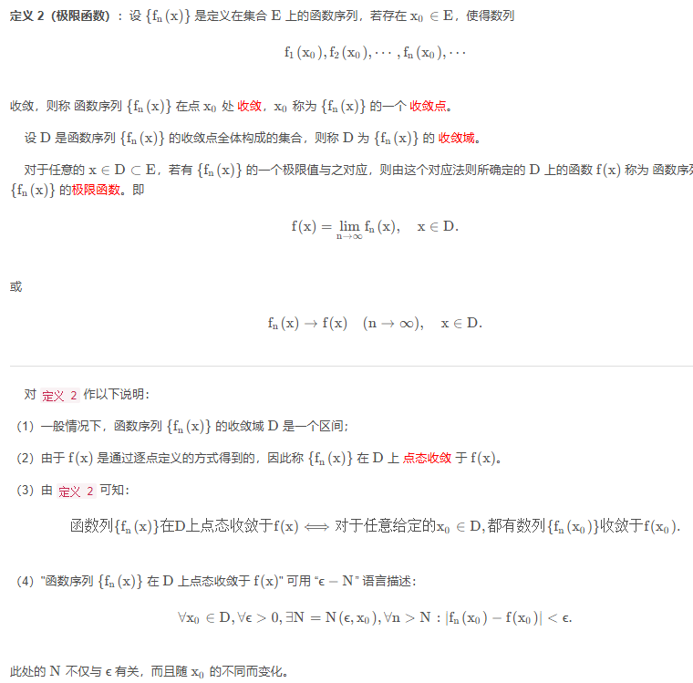
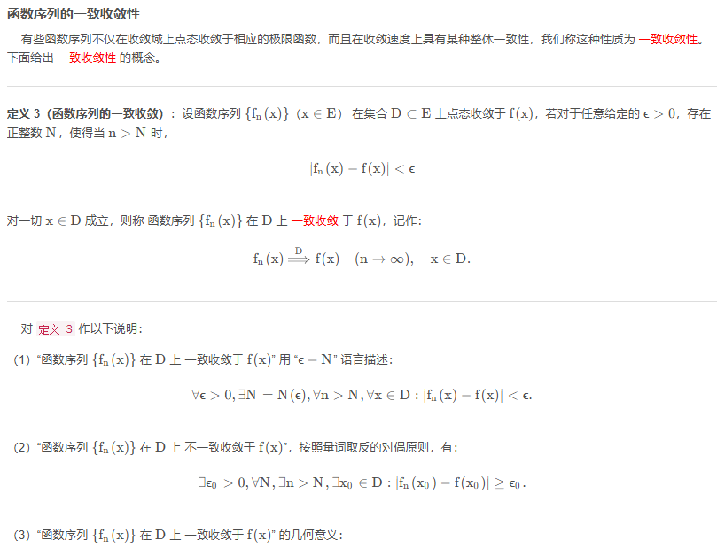
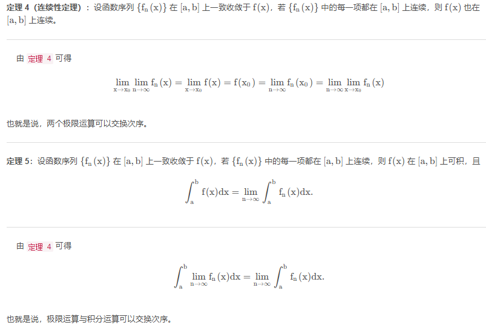
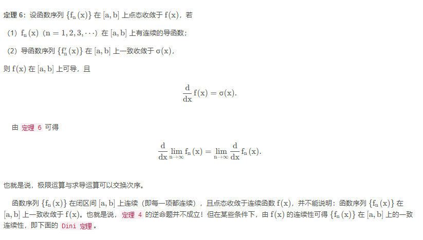

## 一致收敛

### 函数的一致连续

一致连续 (Uniform Continuity) 和连续 (Continuity) 都是描述函数连续性的概念，但它们的定义和含义有所不同。以下是它们的主要区别：

- 一致连续性确保了函数在其整个定义域上的行为是有一定的“一致性”的，而不是在某些地方变化得很快。
- 一致连续的函数在闭区间上一定是连续的，但反之不一定成立。

总的来说，连续性关注的是函数在单个点上的行为，而一致连续性关注的是函数在整个定义域上的行为。

### 函数列的一致收敛

#### 函数序列

#### 极限函数

#### 函数序列的一致收敛性

几何意义：对任意给定的$ϵ>0$,存在正整数$N$,当$n>N$时,曲线$y=f_n(x)$都将落在以曲线$y=f(x)−ϵ$与$y=f(x)+ϵ$为边的带状区域

#### 一致收敛的函数序列的性质

### 一致收敛对级数的影响

## 函数列点态收敛但不一致收敛

考虑函数序列 $ f_n(x) = x^n $，其中 $ x \in [0, 1] $，我们将研究它在区间 $[0, 1]$ 上的收敛性，特别是点态收敛与一致收敛的区别。

### 1. **点态收敛**
我们首先分析 $ f_n(x) = x^n $ 在不同的 $ x $ 值时的收敛行为。

- **当 $ x = 1 $ 时**：
  $
  f_n(1) = 1^n = 1,
  $
  所以 $ f_n(1) $ 始终为 1，并且在 $ x = 1 $ 处收敛于 1。

- **当 $ x = 0 $ 时**：
  $
  f_n(0) = 0^n = 0,
  $
  所以 $ f_n(0) $ 始终为 0，并且在 $ x = 0 $ 处收敛于 0。

- **当 $ 0 < x < 1 $ 时**：
  对于 $ x $ 属于开区间 $ (0, 1) $，由于 $ 0 < x < 1 $，随着 $ n \to \infty $，$ x^n \to 0 $。因此，对于任意的 $ 0 < x < 1 $，我们有：
  $
  \lim_{n \to \infty} f_n(x) = \lim_{n \to \infty} x^n = 0.
  $

### 点态收敛结果：
函数序列 $ f_n(x) = x^n $ **点态收敛**于一个极限函数 $ f(x) $，其中：
$
f(x) =
\begin{cases}
0, & \text{当 } 0 \leq x < 1, \\
1, & \text{当 } x = 1.
\end{cases}
$

### 2. **一致收敛**
接下来我们分析函数序列 $ f_n(x) = x^n $ 是否一致收敛于极限函数 $ f(x) $。

- 根据一致收敛的定义，我们需要找到一个 $ N $，使得对任意 $ n > N $ 和任意 $ x \in [0, 1] $，满足：
  $
  |f_n(x) - f(x)| < \epsilon.
  $

为了判断一致收敛，我们考虑函数序列 $ f_n(x) = x^n $ 和极限函数 $ f(x) $ 之间的差异。当 $ x $ 接近 1 时（例如 $ x = 1 - \delta $，其中 $ \delta $ 很小），我们观察到：

- 对于 $ x $ 非常接近 1 的点，$ x^n $ 仍然接近 1，并且需要非常大的 $ n $ 才能使 $ x^n $ 明显接近 0。因此，对于靠近 1 的点，$ |f_n(x) - f(x)| $ 可能会较大，且无法找到一个统一的 $ N $ 满足所有 $ x \in [0, 1) $ 都满足 $ |f_n(x) - f(x)| < \epsilon $。

例如，对于 $ \epsilon = 0.1 $，当 $ x = 0.9 $ 时，我们需要非常大的 $ n $ 才能使 $ 0.9^n $ 小于 0.1。这表明 $ f_n(x) $ 在整个区间 $ [0, 1] $ 上**不一致收敛**。

### 结论：
- **点态收敛**：函数序列 $ f_n(x) = x^n $ 在 $ [0, 1] $ 上点态收敛于函数 $ f(x) $，其中
  $
  f(x) =
  \begin{cases}
  0, & 0 \leq x < 1, \\
  1, & x = 1.
  \end{cases}
  $
  
- **不一致收敛**：由于在 $ x $ 接近 1 的地方，$ f_n(x) $ 需要很大的 $ n $ 才能接近 0，函数序列 $ f_n(x) $ 不一致收敛于 $ f(x) $。**