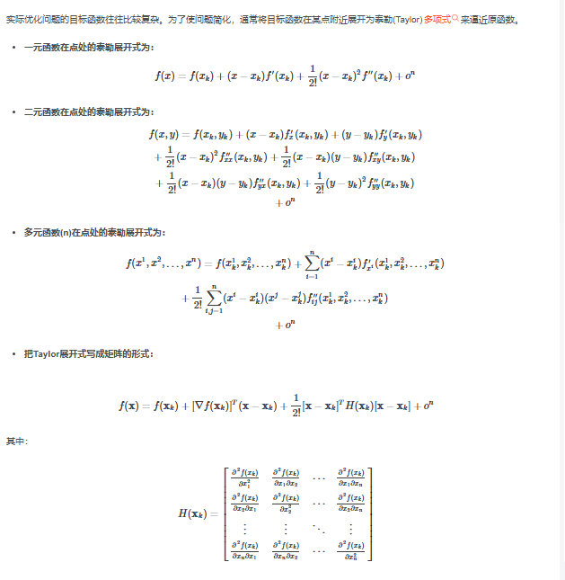
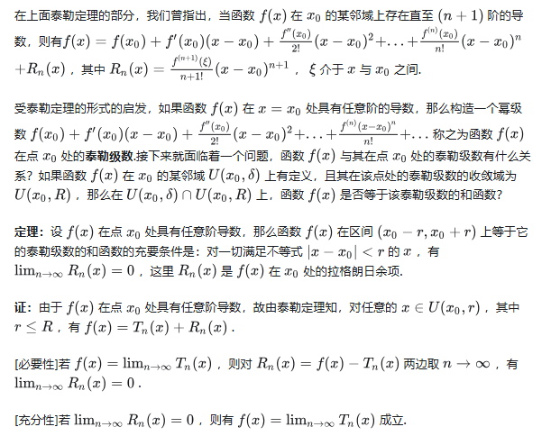

## 泰勒公式

即在点 $x_0$ 附近，我们可以用一次多项式函数 $f(x_0)+f^′(x_0)(x−x_0)$ 来逼近函数 $f(x)$ ，其误差为 $(x−x_0)$ 的高阶无穷小量，有些时候，这样的逼近方式是粗糙的，即逼近的误差较大，于是我们很自然的想到能否让更高次的 $n$ 次多项式去逼近函数 $f(x)$ ，使得误差为 $o((x−x_0)^n)$ 。

所以我们可以使用泰勒公式去逼近某一个函数

### 皮亚诺余项

### 多元函数的泰勒公式

## 幂级数

幂级数（**Power Series**）是数学分析中一种重要的无穷级数形式，它通常表示为一个多项式的无穷展开式。幂级数的形式为：

$
\sum_{n=0}^{\infty} a_n (x - c)^n = a_0 + a_1(x - c) + a_2(x - c)^2 + a_3(x - c)^3 + \cdots
$

其中：
- $a_n$ 是级数中的系数；
- $x$ 是变量；
- $c$ 是中心，称为幂级数的展开点或展开中心。

### 幂级数的收敛性

幂级数在某些区域内可能收敛，而在其他区域可能发散。收敛的区域由收敛半径 $R$ 决定。级数在中心 $c$ 的邻域内收敛，这一区域可以是：
- 如果 $R > 0$，幂级数在以 $c$ 为中心、半径为 $R$ 的开区间内收敛；
- 如果 $R = 0$，幂级数仅在 $x = c$ 处收敛；
- 如果 $R = \infty$，幂级数在整个实数轴上收敛。

收敛半径 $R$ 可以通过**柯西根式**计算：

$
\frac{1}{R} = \lim_{n \to \infty} \sqrt[n]{|a_n|}
$

### 常见的幂级数示例

1. **几何级数**：
   $
   \frac{1}{1-x} = \sum_{n=0}^{\infty} x^n , \quad |x| < 1
   $
   
2. **指数函数的幂级数展开**：
   $
   e^x = \sum_{n=0}^{\infty} \frac{x^n}{n!}, \quad x \in \mathbb{R}
   $

3. **正弦函数的幂级数展开**：
   $
   \sin x = \sum_{n=0}^{\infty} (-1)^n \frac{x^{2n+1}}{(2n+1)!}, \quad x \in \mathbb{R}
   $

4. **余弦函数的幂级数展开**：
   $
   \cos x = \sum_{n=0}^{\infty} (-1)^n \frac{x^{2n}}{(2n)!}, \quad x \in \mathbb{R}
   $

## 泰勒级数

## 泰勒展开式

