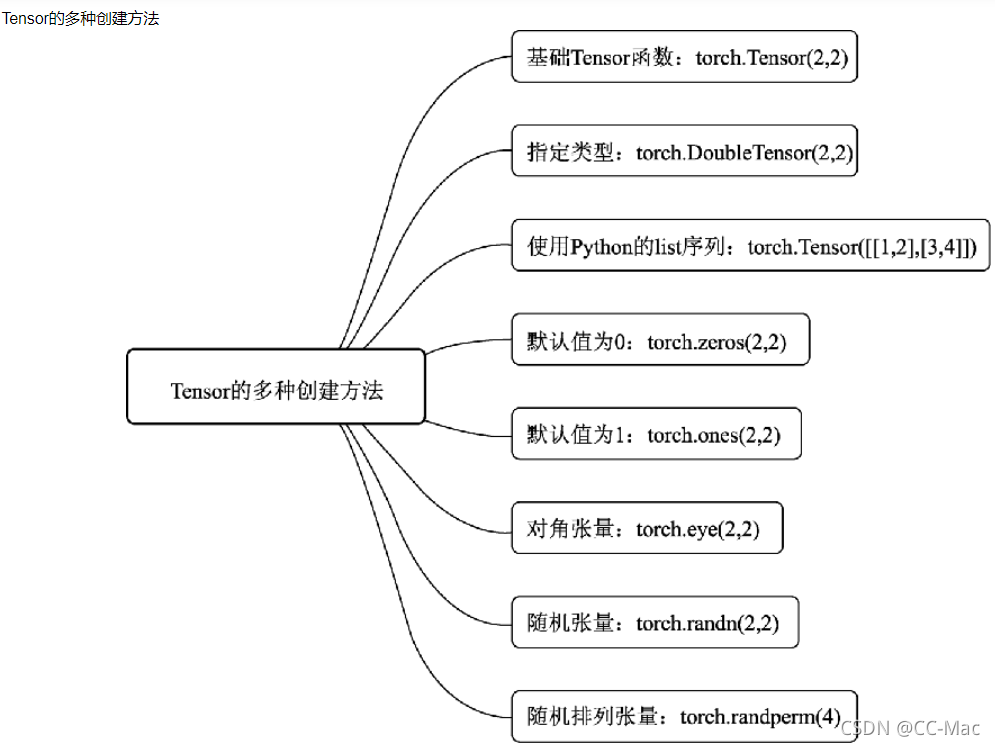

# Pytorch的Tensor

## 一、基本数据：Tensor

Tensor，即张量，是PyTorch中的基本操作对象，可以看做是包含单一数据类型元素的多维矩阵。从使用角度来看，Tensor与NumPy的ndarrays非常类似，相互之间也可以自由转换，只不过Tensor还支持GPU的加速。


### 1.1 Tensor的创建



在 PyTorch 中，`Tensor` 是一种多维数组，类似于 NumPy 的 `ndarray`，同时支持 GPU 加速。可以通过不同的函数来创建 `Tensor`。

**代码示例：**
```python
import torch

# 创建一个 2x3 的随机 Tensor
a = torch.rand(2, 3)
print(a)
```

**输出结果：**
```python
tensor([[0.5625, 0.5815, 0.8221],
        [0.3589, 0.4180, 0.2158]])
```

### 1.2 torch.FloatTensor

`FloatTensor` 是一种元素类型为 `float32` 的 `Tensor`，适用于浮点数的存储和计算。

**代码示例：**
```python
import torch

# 创建一个 FloatTensor
a = torch.FloatTensor([1.0, 2.0, 3.0])
print(a)
```

**输出结果：**
```python
tensor([1., 2., 3.])
```

### 1.3 torch.IntTensor

`IntTensor` 是一种元素类型为 `int32` 的 `Tensor`，适用于整数类型的数据存储。

**代码示例：**
```python
import torch

# 创建一个 2x3 的整数类型 Tensor
a = torch.IntTensor(2, 3)
print(a)

# 通过列表创建一个整数类型的 Tensor
b = torch.IntTensor([[2, 3, 4], [5, 1, 0]])
print(b)
```

**输出结果：**
```python
tensor([[74598400,        521, 1886613091],
        [  664867,          0,          0]], dtype=torch.int32)
tensor([[2, 3, 4],
        [5, 1, 0]], dtype=torch.int32)
```

### 1.4 torch.randn

`torch.randn` 用于创建一个符合标准正态分布（均值为 0，标准差为 1）的 Tensor。

**代码示例：**
```python
import torch

# 创建一个 2x3 的符合标准正态分布的 Tensor
a = torch.randn(2, 3)
print(a)
```

**输出结果：**
```python
tensor([[-0.8067, -0.0707, -0.6682],
        [ 0.8141,  1.1436,  0.5963]])
```

### 1.5 torch.range

`torch.range` 用于创建一个从起始值到终止值的序列 Tensor（包含终止值）。推荐使用 `torch.arange` 代替。

**代码示例：**
```python
import torch

# 创建一个从 1 到 20，步长为 2 的序列 Tensor
a = torch.range(1, 20, 2)
print(a)
```

**输出结果：**
```python
tensor([ 1.,  3.,  5.,  7.,  9., 11., 13., 15., 17., 19.])
```

### 1.6 torch.zeros/ones/empty

`torch.zeros`、`torch.ones` 和 `torch.empty` 用于创建特定初始化方式的 `Tensor`。

**代码示例：**
```python
import torch

# 创建一个 2x2 的全 0 Tensor
zeros_tensor = torch.zeros(2, 2)
print(zeros_tensor)

# 创建一个 2x2 的全 1 Tensor
ones_tensor = torch.ones(2, 2)
print(ones_tensor)

# 创建一个 2x2 的未初始化 Tensor
empty_tensor = torch.empty(2, 2)
print(empty_tensor)
```

**输出结果：**
```python
tensor([[0., 0.],
        [0., 0.]])

tensor([[1., 1.],
        [1., 1.]])

tensor([[4.5414e+21, 3.0706e-41],
        [4.5414e+21, 3.0706e-41]])
```

以上是对每个条目的详细介绍和对应的输出结果，希望这次的回答能够更加详细地帮助你理解 PyTorch 中的 `Tensor` 使用。

## 二、Tensor的运算

### 1. abs

`abs` 是求取张量每个元素的绝对值。这个操作不改变张量的形状。

**代码示例：**
```python
import torch

# 创建一个包含正负数的 Tensor
a = torch.tensor([-1.0, -0.5, 0.0, 0.5, 1.0])
print("原始张量：", a)

# 计算张量的绝对值
abs_tensor = torch.abs(a)
print("绝对值张量：", abs_tensor)
```

**输出结果：**
```python
原始张量： tensor([-1.0000, -0.5000,  0.0000,  0.5000,  1.0000])
绝对值张量： tensor([1.0000, 0.5000, 0.0000, 0.5000, 1.0000])
```

---

### 2. add

`add` 用于对两个张量进行逐元素加法，或将一个标量加到每个元素上。

**代码示例：**
```python
import torch

# 创建两个张量
a = torch.tensor([1, 2, 3])
b = torch.tensor([4, 5, 6])

# 逐元素相加
add_tensor = torch.add(a, b)
print("逐元素相加结果：", add_tensor)

# 张量加标量
add_scalar = torch.add(a, 10)
print("张量加标量结果：", add_scalar)
```

**输出结果：**
```python
逐元素相加结果： tensor([5, 7, 9])
张量加标量结果： tensor([11, 12, 13])
```

---

### 3. clamp

`clamp` 将张量中的每个元素限制在一个指定的范围内。如果某个元素小于指定的最小值，则将其替换为最小值；如果某个元素大于最大值，则将其替换为最大值。

**代码示例：**
```python
import torch

# 创建一个张量
a = torch.tensor([0.1, 0.5, 0.9, 1.5])

# 将张量的值限制在 0.3 和 1.0 之间
clamped_tensor = torch.clamp(a, min=0.3, max=1.0)
print("限制后的张量：", clamped_tensor)
```

**输出结果：**
```python
限制后的张量： tensor([0.3000, 0.5000, 0.9000, 1.0000])
```

---

### 4. div

`div` 用于对两个张量进行逐元素除法，或将张量的每个元素除以一个标量。

**代码示例：**
```python
import torch

# 创建两个张量
a = torch.tensor([4, 9, 16])
b = torch.tensor([2, 3, 4])

# 逐元素相除
div_tensor = torch.div(a, b)
print("逐元素相除结果：", div_tensor)

# 张量除以标量
div_scalar = torch.div(a, 2)
print("张量除以标量结果：", div_scalar)
```

**输出结果：**
```python
逐元素相除结果： tensor([2.0000, 3.0000, 4.0000])
张量除以标量结果： tensor([2.0000, 4.5000, 8.0000])
```

---

### 5. pow

`pow` 用于对张量的每个元素进行幂运算。

**代码示例：**
```python
import torch

# 创建一个张量
a = torch.tensor([1, 2, 3, 4])

# 每个元素求平方
pow_tensor = torch.pow(a, 2)
print("平方结果张量：", pow_tensor)

# 每个元素求立方
pow_tensor_cube = torch.pow(a, 3)
print("立方结果张量：", pow_tensor_cube)
```

**输出结果：**
```python
平方结果张量： tensor([ 1,  4,  9, 16])
立方结果张量： tensor([ 1,  8, 27, 64])
```

---

### 6. mm

`mm` 用于两个二维矩阵的矩阵乘法运算。张量的最后两个维度进行矩阵乘法，其余的维度要么广播，要么保持不变。

**代码示例：**
```python
import torch

# 创建两个二维矩阵
a = torch.tensor([[1, 2], [3, 4]])
b = torch.tensor([[5, 6], [7, 8]])

# 进行矩阵乘法运算
mm_tensor = torch.mm(a, b)
print("矩阵乘法结果：", mm_tensor)
```

**输出结果：**
```python
矩阵乘法结果： tensor([[19, 22],
                    [43, 50]])
```

---

### 7. mv

`mv` 用于一个二维矩阵与一个一维向量的矩阵乘法运算。将二维矩阵的每一行与向量进行点积运算。

**代码示例：**
```python
import torch

# 创建一个二维矩阵和一个一维向量
a = torch.tensor([[1, 2], [3, 4]])
b = torch.tensor([2, 3])

# 进行矩阵与向量乘法
mv_tensor = torch.mv(a, b)
print("矩阵与向量乘法结果：", mv_tensor)
```

**输出结果：**
```python
矩阵与向量乘法结果： tensor([ 8, 18])
```
