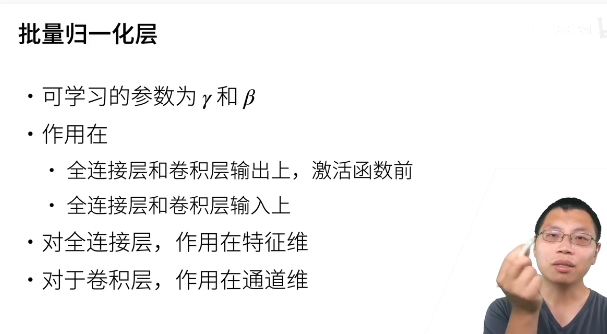
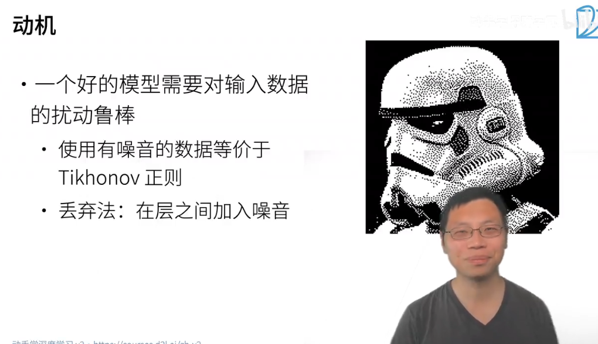
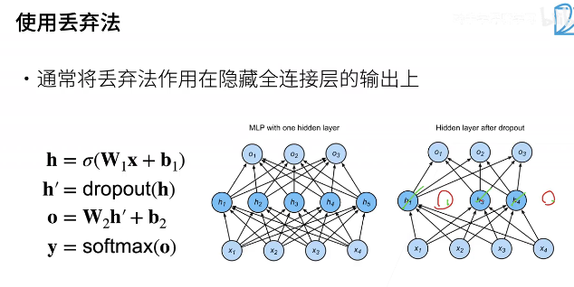
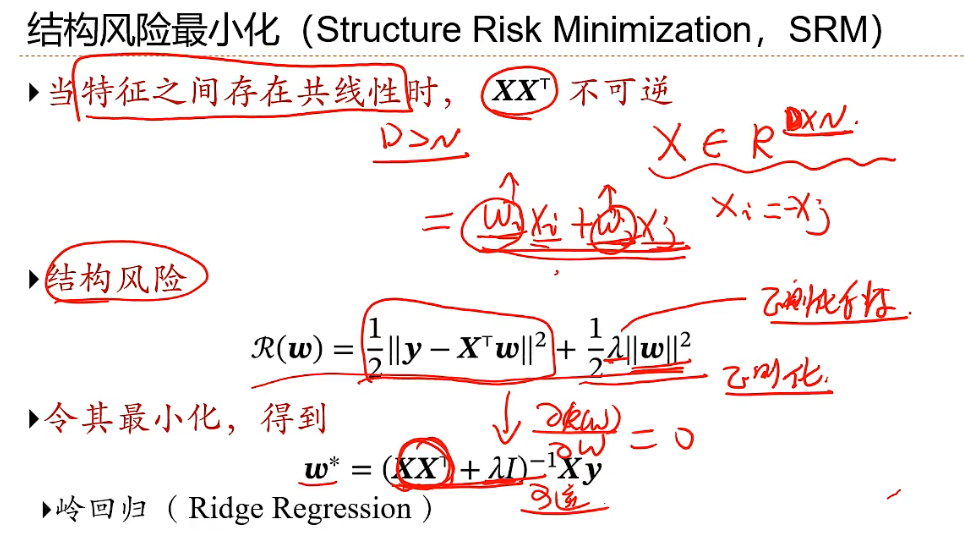

## Normalization

**可能就是在每个小批量中加入噪音来控制模型的复杂度**

**批量归一化**

- 损失出现在最后，后面的层训练较快
- 数据在最底部
  - 底部的层训练较慢
  - 底部层一变化，所有都得跟着变
  - 最后的那些层需要重新学习多次
  - 导致收敛变慢
- 我们可以在学习底部层的时候避免变化顶部层吗?

**批量归一化层**



**减少协变量转移**：最初的论文提出批量归一化的目的是为了减少神经网络内部的协变量转移，即不同层之间的输入分布变化，以便训练过程更加稳定。

**协变量转移**（Covariate Shift）指的是数据分布在不同阶段发生改变的现象。在神经网络的训练中，协变量转移通常发生在不同层之间，即随着数据从一层流向另一层，其特征分布可能会不断变化。这种变化会导致网络的训练变得不稳定，因为每层都需要去适应前一层特征分布的变化，进而使得梯度更新的效果变差，训练时间也变长。

假设我们正在训练一个神经网络，其中某一层的输出作为下一层的输入。如果前一层的参数在训练过程中不断变化，这一层的输出分布也会变化。下一层接收到的输入特征在每个训练迭代中都可能不同，从而导致不稳定的训练过程。

**批量归一化如何减少协变量转移**

批量归一化通过将每一层的输入特征在每个小批量中进行归一化（标准化到相似的分布），使得特征分布更稳定，避免了因前一层的参数更新而带来的剧烈分布变化。这样，后续层接收到的输入特征不会因为前面层的变化而发生剧烈转移，从而有助于更稳定、高效地训练深度神经网络。

**批量归一化的本质还是在小批量的数据里面加入了随机噪音**


- **公式解释**：这是一个线性变化
  - 公式表示的是批量归一化的计算过程：  
    $
    x_{i+1} = \gamma \frac{x_i - \hat{\mu}_B}{\hat{\sigma}_B} + \beta
    $
    - $ x_i $ 是输入特征；
    - $ \hat{\mu}_B $ 和 $ \hat{\sigma}_B $ 分别是小批量数据的均值和标准差；（这里分别称为“随机缩放”和“随机偏移”）
    - $ \gamma $ 和 $ \beta $ 是可训练的参数，用于控制缩放和偏移；

**无需与丢弃法（Dropout）混合使用**：由于批量归一化引入了一定的正则化效果，因此在某些情况下不必与丢弃法同时使用。

```python
import numpy as np

class BatchNormalization:
    def __init__(self, epsilon=1e-5, momentum=0.9):
        self.epsilon = epsilon  # 防止除以零的小值
        self.momentum = momentum
        self.running_mean = 0
        self.running_var = 0
        self.gamma = None  # 缩放参数
        self.beta = None   # 偏移参数

    def initialize_params(self, input_shape):
        # 初始化缩放参数gamma和偏移参数beta
        self.gamma = np.ones(input_shape)
        self.beta = np.zeros(input_shape)

    def forward(self, x, is_training=True):
        if self.gamma is None or self.beta is None:
            self.initialize_params(x.shape[1])

        if is_training:
            # 计算当前小批量数据的均值和方差
            batch_mean = np.mean(x, axis=0)
            batch_var = np.var(x, axis=0)

            # 归一化
            x_normalized = (x - batch_mean) / np.sqrt(batch_var + self.epsilon)

            # 更新全局均值和方差
            self.running_mean = self.momentum * self.running_mean + (1 - self.momentum) * batch_mean
            self.running_var = self.momentum * self.running_var + (1 - self.momentum) * batch_var
        else:
            # 使用训练过程中计算的均值和方差
            x_normalized = (x - self.running_mean) / np.sqrt(self.running_var + self.epsilon)

        # 应用缩放和偏移
        out = self.gamma * x_normalized + self.beta
        return out

# 测试批量归一化
x = np.array([[1, 2], [3, 4], [5, 6]])  # 一个小批量数据
bn = BatchNormalization()
output = bn.forward(x)
print("批量归一化后的输出：\n", output)

```

## Dropout

**在层之间加入噪音**

- 一个好的模型需要对输入数据的扰动鲁棒

- 使用有噪音的数据等价于Tikhonov 正则
- 丢弃法：在层之间加入噪音



**Hinton认为：随机采样一些子神经网络，在整体上对网络做了平均化，这样效果会更好**

**丢弃法通常在试验上认为与正则效果一致**

**dropout层**



## L2正则化和岭回归

**最小二乘法**

最小二乘法（Least Squares Method）是一种回归分析方法，用于通过最小化预测值与实际值之间的误差来找到数据的最佳拟合曲线。在机器学习和统计学中，最小二乘法通常用于线性回归模型，目的是找到最佳拟合的直线来预测目标变量。

**最小二乘法的原理**

假设我们有一组数据点 $(x_1, y_1), (x_2, y_2), \ldots, (x_n, y_n)$，目标是找到一个线性模型：

$
y = ax + b
$

使得模型预测值 $ \hat{y} $ 和真实值 $ y $ 之间的误差最小。

对于每个数据点的误差（残差）定义为：

$
\text{误差} = y_i - \hat{y}_i = y_i - (ax_i + b)
$

最小二乘法的目标是使所有数据点的误差平方和最小化：

$
\text{最小化} \sum_{i=1}^n (y_i - (ax_i + b))^2
$

这个平方误差和被称为“残差平方和”。

**最小二乘法的推导**

通过对 $ a $ 和 $ b $ 求导并令导数为零，可以得到一组线性方程来确定 $ a $ 和 $ b $ 的最优值。具体步骤如下：

1. 对 $ \sum_{i=1}^n (y_i - (ax_i + b))^2 $ 分别对 $ a $ 和 $ b $ 求偏导数，并令其为零。
2. 解得最优的 $ a $ 和 $ b $ 值。

求导得到的公式为：

$
a = \frac{\sum_{i=1}^n (x_i - \bar{x})(y_i - \bar{y})}{\sum_{i=1}^n (x_i - \bar{x})^2}
$

$
b = \bar{y} - a \cdot \bar{x}
$

其中 $ \bar{x} $ 和 $ \bar{y} $ 分别是 $ x $ 和 $ y $ 的均值。

**一般的矩阵解为**

$ Xθ=y $

$ X^TXθ=X^Ty $

$ θ=(X^TX)^{−1}X^Ty $

从上述分析我们知道传统的最小二乘法在矩阵不可逆或病态的情况下缺乏稳定性与可靠性。**岭回归**是一种改良版的最小二乘法，它放弃了最小二乘法的无偏性，但更加稳定可靠，在实际应用中也更加常用。

岭回归（Ridge Regression）是一种线性回归的变体，它通过在损失函数中加入 **L2 正则化项**，来防止过拟合，尤其在自变量之间高度相关或维度较高的情况下，岭回归能够显著改善模型的稳定性和泛化能力。

**先给出结论，岭回归解为：**$ θ=(X^TX+λI)^{−1}X^Ty $

**从机器学习角度来看，岭回归对应着L2正则化。**



### 正则化

L1 和 L2 正则化是最常用的正则化方法

- **L1 regularization**  L1 正则化向目标函数添加正则化项，以减少参数的绝对值总和

- **L2 regularization（权重衰减）**L2 正则化中，添加正则化项的目的在于减少参数平方的总和。L2 正则化，也称为 Ridge(岭) 正则化，通过在模型的损失函数中增加权重的 L2 范数（权重向量的平方和）来实现正则化。
- **Lasso 回归**：使用 L1 正则化，可以使不重要的系数变为零，从而实现特征选择。
- **岭回归**：使用 L2 正则化，压缩系数大小但不将其变为零，适合多重共线性问题，但不会自动选择特征。

### Tikhonov正则化

从维基百科看到的：其中吉洪诺夫矩阵Γ需要适当选取，许多时候选为单位矩阵的标量倍数（Γ=𝛼𝐼），并优先考虑范数较小的解。此时的$λ=𝛼^2$其中正则化参数 λ 始终为非负值

**其实就是岭回归**


### 其余正则化

**L2 正则化是一个更广泛的概念**，而**岭回归是特定于线性回归模型的应用**，它通过加入 L2 正则化来解决回归问题。**岭回归是在线性回归模型中使用 L2 正则化的一种具体应用。**

- L1 正则化：也称为 Lasso 正则化，它通过在模型的损失函数中增加权重的 L1 范数（权重向量的绝对值之和）来实现正则化。L1 正则化倾向于产生稀疏权重矩阵，即将一些权重推向零，从而实现特征选择的效果。

- L2 正则化：也称为 Ridge 正则化，它通过在模型的损失函数中增加权重的 L2 范数（权重向量的平方和）来实现正则化。L2 正则化会使权重值变得较小，但不会直接导致权重稀疏，因此不具有特征选择的作用，但可以有效地控制模型的复杂度。

- Elastic Net 正则化：Elastic Net 是 L1 和 L2 正则化的组合，它在损失函数中同时使用 L1 和 L2 范数，可以综合两者的优点。

- Dropout：Dropout 是一种特殊的正则化技术，通过在训练过程中**随机地丢弃（将其权重置为零）网络中的部分神经元**，以及它们的连接，来减少神经网络的复杂度。这样可以防止神经元之间的共适应性，从而减少过拟合。

- 早停（Early Stopping）：早停是一种简单而有效的正则化方法，它在训练过程中监视模型在**验证集**上的性能，一旦验证集上的性能开始下降，就停止训练。这样可以避免模型在训练集上过拟合。

- 数据增强（Data Augmentation）：数据增强是通过对训练数据进行变换来增加数据的多样性，从而减少过拟合的风险。例如，在图像分类任务中可以进行随机裁剪、旋转、翻转等操作来增加训练数据的数量和多样性。

- 批量归一化（Batch Normalization）：批量归一化是一种通过对每个批次的输入进行归一化来加速训练并减少过拟合的技术。它可以使得每一层的输入分布稳定，从而更容易优化模型。

- 权重衰减（Weight Decay）：权重衰减是一种通过在损失函数中增加权重的平方和或绝对值之和来实现正则化的技术。它等价于对权重参数进行 L2 正则化。
