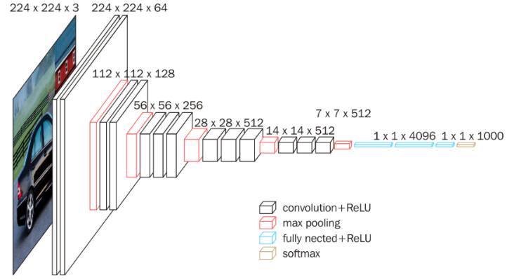

# CTPN

CTPN (Connectionist Text Proposal Network) 是一种用于场景文本检测的深度学习模型，特别适用于检测自然场景图像中的水平文本线。它结合了卷积神经网络（CNN）和循环神经网络（RNN）来生成高效的文本行预测。CTPN 的结构主要由以下几个部分组成：

## 1. VGG16 特征提取 (左侧部分)

- **VGG16** 是一个经典的卷积神经网络，用于提取图像的特征。在这个过程中，图像通过多个卷积层和池化层，最终生成一个特征图。
- 图中的灰色矩形表示输入图像，VGG16 会处理这个图像并输出一个特征图。特征图的维度通常是 `W × H × C`，其中：
  - `W` 表示宽度（特征图的列数）
  - `H` 表示高度（特征图的行数）
  - `C` 表示通道数（特征图的深度，通常是 512 或 256）

VGG16 是一种经典的卷积神经网络架构，常用于计算机视觉任务，如图像分类和特征提取。在 CTPN 中，VGG16 被用来从输入图像中提取深度的视觉特征。接下来我会详细解释 VGG16 的特征提取过程，逐层分析各个卷积块及其作用。

---

**VGG16 网络架构简介**

VGG16 由 16 层网络组成，其中包括 13 层卷积层和 3 层全连接层。主要部分是卷积和池化层的交替堆叠，卷积层用于提取图像特征，而池化层则用于下采样，以减少特征图的尺寸，同时保留重要特征。VGG16 的输入是尺寸为 224×224×3 的 RGB 图像，输出是高维的特征向量或特征图。

### VGG16 的主要层次
在特征提取任务中，VGG16 的卷积层是核心部分，具体的操作过程如下：

#### 1. **输入层**
- 输入到 VGG16 的图像大小通常为 `224×224×3`，这意味着输入的图像高和宽为 224 像素，有 3 个通道（即 RGB 图像）。
- 图像首先会通过一系列的卷积层和池化层，逐步减少空间维度（宽度和高度），但逐步增加通道数（特征图深度），以提取更加高层次的特征。

#### 2. **卷积块 (Convolutional Block)**
VGG16 中包含 5 个卷积块 (Conv Blocks)，每个块由若干个卷积层和池化层组成。

**卷积层操作：**
- **卷积核 (filter/kernel)：** 卷积层使用多个大小为 `3×3` 的卷积核提取局部特征。这些卷积核会在图像的不同位置进行滑动，提取图像的边缘、纹理、轮廓等局部特征。
- **激活函数 (ReLU)：** 每个卷积层后接一个 ReLU 激活函数，用于引入非线性，确保模型可以处理复杂特征。
  

每个卷积块后通常会加上一个 **最大池化层 (Max Pooling)**，其作用是对卷积层的输出进行下采样，减少空间维度，同时保留主要特征。

以下是各卷积块的详细结构：

- **Conv Block 1：**
  - 2 个卷积层，卷积核大小为 `3×3`，输出通道数为 64（即 64 个卷积核）。
  - 输入图像的尺寸不变，输出的特征图大小为 `224×224×64`。
  - **最大池化**：池化层将特征图下采样，大小变为 `112×112×64`。

- **Conv Block 2：**
  - 2 个卷积层，卷积核大小仍为 `3×3`，输出通道数为 128。
  - 输出特征图大小为 `112×112×128`。
  - **最大池化**：池化层将特征图下采样，大小变为 `56×56×128`。

- **Conv Block 3：**
  - 3 个卷积层，卷积核大小为 `3×3`，输出通道数为 256。
  - 输出特征图大小为 `56×56×256`。
  - **最大池化**：池化层将特征图下采样，大小变为 `28×28×256`。

- **Conv Block 4：**
  - 3 个卷积层，卷积核大小为 `3×3`，输出通道数为 512。
  - 输出特征图大小为 `28×28×512`。
  - **最大池化**：池化层将特征图下采样，大小变为 `14×14×512`。

- **Conv Block 5：**
  - 3 个卷积层，卷积核大小为 `3×3`，输出通道数为 512。
  - 输出特征图大小为 `14×14×512`。
  - **最大池化**：池化层将特征图下采样，大小变为 `7×7×512`。

#### 3. **CTPN 中的特征图 (Conv5)**
在 CTPN 中，我们并不会使用 VGG16 的全连接层，而是从第五个卷积块的输出 (即 `Conv Block 5`) 中提取特征图。此时的特征图大小为 `H×W×C`，具体尺寸取决于输入图像的大小和经过的卷积操作后缩减的比例。通常情况下，`H` 和 `W` 分别比原图的高和宽缩小了 32 倍左右，通道数 `C` 是 512。

这些卷积特征图保留了输入图像的高级空间信息，是 CTPN 后续进行文本检测的基础。

#### 4. **全局特征保留**
- 经过 5 个卷积块的处理，VGG16 提取的特征图不仅包含了原始图像的低级特征（如边缘、纹理），还通过多个卷积层的叠加，捕获了高级语义信息。这使得网络能够对复杂的场景中的文本进行良好的识别。
- 在 CTPN 中，使用 VGG16 的最后一层卷积特征 (Conv5) 作为输入特征图，结合后续的双向 LSTM 来进一步捕获文本的行信息。

**小结**

- **VGG16** 提取的是输入图像的多层次特征，从简单的边缘检测，到复杂的模式识别，这些卷积特征为 CTPN 的文本检测提供了丰富的视觉信息。
- **CTPN 只使用 VGG16 的卷积层**，不使用全连接层，因为特征图是用于检测而不是分类的。

### 卷积核

#### 1. 第一层的卷积核：3×3×3

在 VGG16 的第一层，输入图像通常是 RGB 图像，尺寸为 `224×224×3`，有 3 个通道（红、绿、蓝）。所以：
- **卷积核的大小**是 `3×3×3`，其中最后一个 `3` 对应输入图像的 3 个通道。
- 每个卷积核会在这 3 个通道上分别进行卷积运算，最后将结果加和生成一个输出通道。

VGG16 第一层有 64 个卷积核，所以它会输出 64 个特征图，大小为 `224×224×64`。

#### 2. 第二层的卷积核：3×3×64

当进入 VGG16 的第二层时，第一层已经将图像转换为 `224×224×64` 的特征图，**第二层卷积核的深度**就必须与输入特征图的通道数相匹配，也就是 `64` 个通道。因此：
- **卷积核的大小**变成 `3×3×64`，因为输入特征图有 64 个通道。
- 每个卷积核会在这 64 个通道上分别进行卷积，最后将结果加和，生成一个新的输出通道。

VGG16 的第二层有 128 个卷积核，所以输出的是 128 个特征图，大小为 `112×112×128`（经过池化之后）。

#### 3. 卷积核的通道数与输入相匹配

总结一下：
- **第一层卷积核**：由于输入是 `224×224×3`（RGB），卷积核的大小为 `3×3×3`。
- **第二层卷积核**：输入是 `224×224×64`（第一层的输出），卷积核的大小为 `3×3×64`。
- **每一层的卷积核的深度**必须等于输入特征图的通道数，才能在所有通道上进行卷积操作。

#### 4. 每一层卷积的基本规则

- 卷积核的**空间尺寸**（例如 `3×3`）控制了局部区域的感受野（即卷积操作覆盖的区域）。
- 卷积核的**深度**必须等于输入的通道数。它会在所有通道上执行卷积运算，并且输出一个通道。
- 多个卷积核（例如 64 个、128 个等）意味着卷积层可以学习更多的特征，每个卷积核学习到一种不同的图像局部模式。

## 2. 卷积特征图 (Conv5)

- VGG16 的输出特征图被标记为 `Conv5`，表示从 VGG16 的第五层卷积特征中提取的特征图。
- 图中绿色框和红色框代表了 CTPN 处理图像的局部区域。它使用滑动窗口方法，遍历特征图的每一列，每一列都会被看作是一个 "小候选区域"。
- 这种滑动窗口的区域大小通常是 3 × 3，表示在宽度为 3，高度为 3 的特征图块中提取文本特征。

在 CTPN（Connectionist Text Proposal Network）模型中，**Conv5** 层是模型中特征提取的一个关键部分，用来提取高层次的文本候选区域特征。Conv5 的输出特征图起着重要作用，为后续的 BLSTM 层提供输入。我们来详细分析一下 Conv5 的作用及其结构。

### 1. **Conv5 层的输入**
在 CTPN 模型中，Conv5 层之前的特征提取部分通常采用预训练的 VGG16 网络。在 VGG16 中，特征提取的过程如下：
- 输入图像经过多层卷积层（Conv Block 1 到 Conv Block 4）提取低层次特征。
- 到 Conv Block 5 时，输入图像的尺寸已经经过多次下采样，特征图的尺寸大大缩小，同时通道数逐渐增多。

具体来说，Conv5 层的输入是来自 VGG16 第五个卷积块（Conv Block 5）的输出特征图。此时的输入特征图尺寸为：
- **宽度 W**：图像宽度经过多次下采样，通常比原始图像小许多。
- **高度 H**：图像高度与宽度一样经过下采样缩小。
- **通道数**：512 个通道（在 VGG16 的 Conv Block 5 中，输出的特征图通道数是 512）。

### 2. **Conv5 层的结构**
在 CTPN 中，Conv5 继续对特征图进行卷积运算，以进一步提取图像的高级特征。通常使用的卷积核是 `3×3`，并且保持相同的填充和步幅以确保输出特征图的尺寸在空间上保持一致。

- **卷积操作**：使用 `3×3` 大小的卷积核，它在每个局部区域提取特征。
- **通道数**：Conv5 层的输出通道数通常被设置为 256，即每个卷积核生成一个特征图，最后输出 256 个通道。
- **填充（padding）**：通过适当的填充（通常为 1），保持输出特征图的空间尺寸不变，使得卷积运算之后特征图的宽度和高度与输入一致。
- **步幅（stride）**：通常设置为 1，使得卷积核逐个像素滑动，不跳过任何位置。

### 3. **Conv5 层的输出特征图**
Conv5 层的输出特征图具有以下特点：
- **尺寸**：与输入特征图的宽度和高度保持一致，因为卷积核的步幅是 1，填充使得边界不丢失信息。
- **通道数**：卷积核的数量为 256，因此输出的特征图的通道数是 256。
  

假设输入特征图的尺寸是 `H×W×512`，那么 Conv5 层的输出特征图的尺寸为：
- **H×W×256**

此时，图像的空间维度保持不变，但特征的通道数从 512 减少到 256。这个降维的操作是为了减少计算负担，同时提取更加精简和有意义的特征。

### 4. **Conv5 输出特征图的作用**
Conv5 层的输出特征图主要作用如下：
- **特征表示**：通过卷积操作，Conv5 提取了更高级的特征。对于文本检测任务，这些特征包含了图像中的复杂模式，包括文本的边缘信息、纹理信息等。
- **连接到 BLSTM 层**：Conv5 层的输出会作为后续双向 LSTM（BLSTM）层的输入。LSTM 层用于捕捉文本的长短时依赖关系，进一步精确定位文本区域。因此，Conv5 层的输出特征图为后续序列模型提供了强大的上下文信息。

### 5. **小结：**
- **Conv5 的输入**：来自 VGG16 的 Conv Block 5，特征图大小为 `H×W×512`。
- **Conv5 的结构**：使用 `3×3` 的卷积核，生成 256 个通道的输出特征图。
- **Conv5 的输出**：特征图大小为 `H×W×256`，通过卷积操作，提取了高级特征，保持了空间维度不变。
- **作用**：为后续的 BLSTM 层提供输入，用于进一步处理文本候选区域的上下文信息。

Conv5 层的输出特征图可以视为图像经过深度特征提取后的高级语义信息，这些信息对于检测任务尤其是文本检测至关重要。

### 图的意思

图片中的标注 `3x3xC -> 256D` 和 "Recurrent" 是对卷积层和循环层（如 LSTM）的描述。我们可以分解这个图中的信息：

#### 3×3×C -> 256D

- **3×3**: 表示卷积核的空间尺寸为 `3×3`。
- **C**: 表示输入特征图的通道数。C 是一个变量，根据输入的通道数确定。在 CTPN 的 Conv5 层中，输入的通道数一般是 512（如之前讨论的 `14×14×512` 特征图）。
- **256D**: 表示输出通道数（特征图的深度）为 256，经过这个卷积层后，特征图的通道数从 `C`（如 512）变为 256。

因此，这表示一次 `3×3` 的卷积操作，将输入的 `C` 个通道的特征图转换为 256 个通道的特征图。

#### Recurrent

"Recurrent" 代表循环神经网络层的引入。在 CTPN 中，特征图通过卷积层后，接入 **BLSTM**（双向长短期记忆网络，Bidirectional LSTM）。BLSTM 通过在水平方向（通常是宽度方向）处理特征图来捕获文本的序列依赖关系。

- 图中表示 一个 `3×3` 卷积操作，输入通道数为 `C`，输出 256 个通道的特征图。
- 然后输出特征图会传递到一个 **循环神经网络（Recurrent）** 层，通常是 BLSTM，用于捕获文本区域的上下文信息。

## 3. 双向 LSTM (BLSTM)

- 在卷积特征提取之后，CTPN 使用双向 LSTM 进行序列建模。
- BLSTM (Bidirectional LSTM) 会在特征图的每一列上进行操作，结合横向的上下文信息。BLSTM 的作用是通过前向和后向的序列建模，更好地捕捉文本行中的关联信息。
- 这一步是为了帮助模型检测连续的文本区域，因为场景中的文本通常是连贯的。
- 输出的特征维度通常为 256D。

在 CTPN（Connectionist Text Proposal Network）模型中，**BLSTM（双向长短期记忆网络，Bidirectional Long Short-Term Memory）** 是用来处理特征图的水平序列信息的关键部分，尤其是对于文本检测，它帮助捕获上下文关系。下面详细介绍图中 BLSTM 的作用和结构。

### 1. **BLSTM 的基本结构**
BLSTM 是一种循环神经网络（RNN）的变体，由两个方向的 LSTM 组成：
- **正向 LSTM**：从左到右处理序列数据。
- **反向 LSTM**：从右到左处理相同的序列数据。

通过这两个方向的 LSTM，BLSTM 能够捕获输入序列中每个位置的前后依赖信息，特别适合处理具有序列性质的数据，例如文本。

### 2. **在 CTPN 中的作用**
在 CTPN 中，输入到 BLSTM 层的是从卷积层（如 Conv5 层）提取到的特征图。BLSTM 主要用于处理特征图的 **水平序列信息**。具体来说，特征图的每一列（从上到下的列，固定高度为 `H = 1`）被视为一个时间步的数据，因此可以按列来处理这些特征：

- 假设 Conv5 层的输出是大小为 **`H×W×256`** 的特征图，其中：
  - `H` 是特征图的高度（通常高度为 1）。
  - `W` 是特征图的宽度，表示在水平方向上有多少列。
  - `256` 是特征图的通道数，也可以看作是每个位置上的特征向量。

BLSTM 通过沿水平方向（即宽度 `W` 的维度）处理这些列，每一列被视为一个时间步，将每列上的 256 维特征作为输入，捕捉到图像宽度方向的上下文信息。这对处理水平排列的文本行特别有用。

### 3. **BLSTM 的工作过程**
假设 Conv5 层的输出特征图大小为 **`H = 1, W = W, D = 256`**，BLSTM 的处理过程可以分为以下几步：

1. **特征图的展开**：
   - 特征图的每一列（宽度方向的每个位置）都会被视作一个时间步。对于每一列上的 256 个特征通道，BLSTM 会逐列处理。
   
2. **正向 LSTM**：
   - 从左到右（即从左到右依次处理特征图的列），正向 LSTM 会逐步生成每个时间步的隐状态，捕捉从左到右的序列依赖信息。

3. **反向 LSTM**：
   - 同时，反向 LSTM 从右到左处理特征图的列，生成每个时间步的反向隐状态，捕捉从右到左的序列依赖。

4. **双向 LSTM 输出**：
   - 正向和反向的隐状态结合在一起，形成一个新的特征表示，该表示同时包含了前后依赖信息。
   - 输出的特征维度会是 `W×512`，因为每个时间步的正向和反向 LSTM 各自输出 256 维的特征，合在一起是 512 维。

### 4. **BLSTM 的输出**
- **输入**：每一列的 256 维特征向量作为 LSTM 的输入。
- **输出**：每一列经过 BLSTM 处理后，输出是 512 维的特征（因为每个方向各有 256 维），最终生成大小为 `W×512` 的特征图。

这就意味着，经过 BLSTM 处理后，特征图的列（即时间步）的特征维度从 256 变为 512，并且每一列的特征包含了从左到右和从右到左的序列信息。

### 5. **BLSTM 在 CTPN 中的作用**
- **捕获上下文信息**：对于文本检测，文本往往是水平排列的序列，BLSTM 通过沿水平方向处理特征图，能够有效捕捉到字符间、单词间的上下文关系。
- **增强特征表示**：通过结合前后两个方向的信息，BLSTM 提供了比单向 LSTM 更丰富的序列特征，这有助于更准确地定位和识别文本行。

### 6. **小结**
- **BLSTM 输入**：来自卷积层（如 Conv5）的输出特征图，大小为 `H×W×256`（其中 `H = 1`，`W` 是宽度，`256` 是特征通道数）。
- **BLSTM 结构**：由两个方向的 LSTM 组成，一个从左到右，一个从右到左，捕捉特征图列之间的依赖关系。
- **BLSTM 输出**：每一列的特征从 256 维变为 512 维，输出特征图的尺寸为 `W×512`，用于后续的全连接层和文本检测。

BLSTM 在 CTPN 中扮演了非常重要的角色，因为它有效地将特征图中的序列信息（尤其是水平方向的文本依赖）提取出来，使得模型能够更加准确地进行文本行检测和定位。

## 4.全连接层 (FC)

- 双向 LSTM 输出的特征会传递给全连接层（FC），在这里生成多个输出预测。
- 这些输出预测包括以下几个部分：
  - **2k 垂直坐标 (2k vertical coordinates)**：用于预测文本框的顶部和底部边界。`2k` 表示每个列有多个候选框的边界预测。
  - **2k 文本存在概率 (2k scores)**：每个候选框的分类得分，用于判断该框内是否存在文本。
  - **k 侧边精细化 (k side-refinement)**：调整预测框的精度，确保文本框的位置更加准确。

**全连接层（FC layer）的详细介绍**

在 **CTPN**（Connectionist Text Proposal Network）模型中，全连接层（**FC layer**）是模型的关键部分之一。它主要负责将从卷积层和 **BLSTM** 层提取到的特征映射到指定的输出目标。

### 1. 全连接层的基本概念
全连接层是一个线性变换层，作用类似于传统的线性回归。公式表示为：

$y = Wx + b$

其中：
- $x$ 是输入特征向量，
- $W$ 是权重矩阵，
- $b$ 是偏置项，
- $y$ 是输出特征。

全连接层的主要功能是将输入特征映射到目标维度，例如文本框的坐标、分类得分等。

### 2. 全连接层的输入

CTPN 模型中，全连接层的输入来自 **BLSTM** 层。经过 BLSTM 处理后，每一列特征会变为 **512 维** 的向量。假设 BLSTM 的输出特征图尺寸为 $W \times 512$，其中 $W$ 是特征图的宽度（即列数），每一列对应一个时间步。

### 3. 全连接层的作用

全连接层将 **BLSTM** 层的输出特征进一步映射到三个不同的输出目标：
1. **2k 个垂直坐标**：表示每个 anchor 的顶部和底部的垂直位置。
2. **2k 个分类得分**：用于判断每个 anchor 是否包含文本。
3. **k 个边界微调参数**：进一步细化 anchor 的左右边界。

### 4. 全连接层的输出

经过全连接层，特征图中的每一列（即每个 anchor 对应的特征）被映射为多个输出。这些输出分别用于文本检测的不同任务。

#### 1. 垂直坐标回归 (2k vertical coordinates)
全连接层会输出 $2k$ 个垂直坐标，表示 anchor 的顶部和底部的偏移量。这些值将帮助调整 anchor 的垂直位置，以更准确地定位文本框。

#### 2. 分类得分 (2k scores)
输出 $2k$ 个分类得分，每个 anchor 都有两个得分：一个表示该 anchor 包含文本的概率，另一个表示该 anchor 不包含文本的概率。

#### 3. 侧边界微调 (k side-refinement)
为了进一步精确地检测文本框的边界，全连接层还会输出 $k$ 个侧边界微调参数，帮助在水平方向上对 anchor 的左右边界进行细微调整。

### 5. 全连接层的输出结构

在 CTPN 模型中，全连接层的输出结构如下：
- $2k$ 个垂直坐标，用于回归顶部和底部坐标；
- $2k$ 个分类得分，表示包含文本和不包含文本的概率；
- $k$ 个侧边界微调参数，用于细化左右边界。

因此，全连接层将每一列的 $512$ 维特征向量（来自 BLSTM 的输出）映射到一个长度为 **$4k$** 的向量：

$\text{Output} = [2k \text{ vertical coordinates}, 2k \text{ classification scores}, k \text{ side-refinement}]$

## 5. 预测输出

- 最终，CTPN 输出的是每列的候选文本框。每个候选框都有概率分数、上下边界坐标，以及水平侧边精细化预测。
- CTPN 会基于这些预测框应用 **非极大值抑制 (NMS)**，去除重叠框，并拼接相邻的文本候选框，生成完整的文本行。

经过全连接层的输出后，模型会生成一系列候选的文本框。这些候选框需要经过一系列后处理步骤，以过滤掉无效的框并进行合并。后处理包括：

- **非极大值抑制（NMS）**：用于去除重叠的 anchor，只保留置信度最高的文本框。
- **合并文本框**：将相邻且属于同一文本行的文本框合并，生成最终的检测结果。

## 总结：

1. **VGG16** 提取图像的卷积特征。
2. **滑动窗口** 在特征图的每一列上提取局部区域。
3. **双向 LSTM** 结合左右上下文信息，帮助序列预测。
4. **全连接层** 预测文本框的坐标、分类得分和边界调整。
5. **后处理步骤** 拼接候选框，最终生成完整的文本检测结果。

通过这种架构，CTPN 能够在自然场景中有效检测到水平文本。