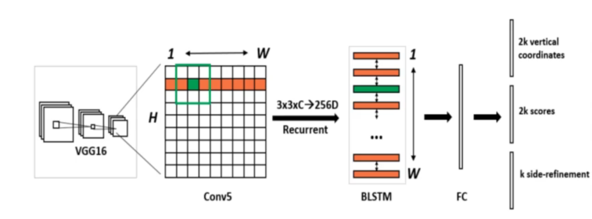

# CTPN

CTPN (Connectionist Text Proposal Network) 是一种用于场景文本检测的深度学习模型，特别适用于检测自然场景图像中的水平文本线。它结合了卷积神经网络（CNN）和循环神经网络（RNN）来生成高效的文本行预测。CTPN 的结构主要由以下几个部分组成：

## 1. VGG16 特征提取 (左侧部分)

- **VGG16** 是一个经典的卷积神经网络，用于提取图像的特征。在这个过程中，图像通过多个卷积层和池化层，最终生成一个特征图。
- 图中的灰色矩形表示输入图像，VGG16 会处理这个图像并输出一个特征图。特征图的维度通常是 `W × H × C`，其中：
  - `W` 表示宽度（特征图的列数）
  - `H` 表示高度（特征图的行数）
  - `C` 表示通道数（特征图的深度，通常是 512 或 256）

VGG16 是一种经典的卷积神经网络架构，常用于计算机视觉任务，如图像分类和特征提取。在 CTPN 中，VGG16 被用来从输入图像中提取深度的视觉特征。接下来我会详细解释 VGG16 的特征提取过程，逐层分析各个卷积块及其作用。

**VGG16 网络架构简介**

VGG16 由 16 层网络组成，其中包括 13 层卷积层和 3 层全连接层。主要部分是卷积和池化层的交替堆叠，卷积层用于提取图像特征，而池化层则用于下采样，以减少特征图的尺寸，同时保留重要特征。VGG16 的输入是尺寸为 224×224×3 的 RGB 图像，输出是高维的特征向量或特征图。

### VGG16 的主要层次
在特征提取任务中，VGG16 的卷积层是核心部分，具体的操作过程如下：

#### 1. **输入层**
- 输入到 VGG16 的图像大小通常为 `224×224×3`，这意味着输入的图像高和宽为 224 像素，有 3 个通道（即 RGB 图像）。
- 图像首先会通过一系列的卷积层和池化层，逐步减少空间维度（宽度和高度），但逐步增加通道数（特征图深度），以提取更加高层次的特征。

#### 2. **卷积块 (Convolutional Block)**
VGG16 中包含 5 个卷积块 (Conv Blocks)，每个块由若干个卷积层和池化层组成。

**卷积层操作：**
- **卷积核 (filter/kernel)：** 卷积层使用多个大小为 `3×3` 的卷积核提取局部特征。这些卷积核会在图像的不同位置进行滑动，提取图像的边缘、纹理、轮廓等局部特征。
- **激活函数 (ReLU)：** 每个卷积层后接一个 ReLU 激活函数，用于引入非线性，确保模型可以处理复杂特征。
  

每个卷积块后通常会加上一个 **最大池化层 (Max Pooling)**，其作用是对卷积层的输出进行下采样，减少空间维度，同时保留主要特征。

以下是各卷积块的详细结构：

- **Conv Block 1：**
  - 2 个卷积层，卷积核大小为 `3×3`，输出通道数为 64（即 64 个卷积核）。
  - 输入图像的尺寸不变，输出的特征图大小为 `224×224×64`。
  - **最大池化**：池化层将特征图下采样，大小变为 `112×112×64`。

- **Conv Block 2：**
  - 2 个卷积层，卷积核大小仍为 `3×3`，输出通道数为 128。
  - 输出特征图大小为 `112×112×128`。
  - **最大池化**：池化层将特征图下采样，大小变为 `56×56×128`。

- **Conv Block 3：**
  - 3 个卷积层，卷积核大小为 `3×3`，输出通道数为 256。
  - 输出特征图大小为 `56×56×256`。
  - **最大池化**：池化层将特征图下采样，大小变为 `28×28×256`。

- **Conv Block 4：**
  - 3 个卷积层，卷积核大小为 `3×3`，输出通道数为 512。
  - 输出特征图大小为 `28×28×512`。
  - **最大池化**：池化层将特征图下采样，大小变为 `14×14×512`。

- **Conv Block 5：**
  - 3 个卷积层，卷积核大小为 `3×3`，输出通道数为 512。
  - 输出特征图大小为 `14×14×512`。
  - **最大池化**：池化层将特征图下采样，大小变为 `7×7×512`。

#### 3. **CTPN 中的特征图 (Conv5)**
在 CTPN 中，我们并不会使用 VGG16 的全连接层，而是从第五个卷积块的输出 (即 `Conv Block 5`) 中提取特征图。此时的特征图大小为 `H×W×C`，具体尺寸取决于输入图像的大小和经过的卷积操作后缩减的比例。通常情况下，`H` 和 `W` 分别比原图的高和宽缩小了 32 倍左右，通道数 `C` 是 512。

这些卷积特征图保留了输入图像的高级空间信息，是 CTPN 后续进行文本检测的基础。

#### 4. **全局特征保留**
- 经过 5 个卷积块的处理，VGG16 提取的特征图不仅包含了原始图像的低级特征（如边缘、纹理），还通过多个卷积层的叠加，捕获了高级语义信息。这使得网络能够对复杂的场景中的文本进行良好的识别。
- 在 CTPN 中，使用 VGG16 的最后一层卷积特征 (Conv5) 作为输入特征图，结合后续的双向 LSTM 来进一步捕获文本的行信息。

**小结**

- **VGG16** 提取的是输入图像的多层次特征，从简单的边缘检测，到复杂的模式识别，这些卷积特征为 CTPN 的文本检测提供了丰富的视觉信息。
- **CTPN 只使用 VGG16 的卷积层**，不使用全连接层，因为特征图是用于检测而不是分类的。

如果你有更多关于 VGG16 或其特征提取在 CTPN 中的细节问题，我可以进一步详细解答！

## 2. 卷积特征图 (Conv5)

- VGG16 的输出特征图被标记为 `Conv5`，表示从 VGG16 的第五层卷积特征中提取的特征图。
- 图中绿色框和红色框代表了 CTPN 处理图像的局部区域。它使用滑动窗口方法，遍历特征图的每一列，每一列都会被看作是一个 "小候选区域"。
- 这种滑动窗口的区域大小通常是 3 × 3，表示在宽度为 3，高度为 3 的特征图块中提取文本特征。

## 3. 双向 LSTM (BLSTM)

- 在卷积特征提取之后，CTPN 使用双向 LSTM 进行序列建模。
- BLSTM (Bidirectional LSTM) 会在特征图的每一列上进行操作，结合横向的上下文信息。BLSTM 的作用是通过前向和后向的序列建模，更好地捕捉文本行中的关联信息。
- 这一步是为了帮助模型检测连续的文本区域，因为场景中的文本通常是连贯的。
- 输出的特征维度通常为 256D。

## 4.全连接层 (FC)

- 双向 LSTM 输出的特征会传递给全连接层（FC），在这里生成多个输出预测。
- 这些输出预测包括以下几个部分：
  - **2k 垂直坐标 (2k vertical coordinates)**：用于预测文本框的顶部和底部边界。`2k` 表示每个列有多个候选框的边界预测。
  - **2k 文本存在概率 (2k scores)**：每个候选框的分类得分，用于判断该框内是否存在文本。
  - **k 侧边精细化 (k side-refinement)**：调整预测框的精度，确保文本框的位置更加准确。

## 5. 预测输出

- 最终，CTPN 输出的是每列的候选文本框。每个候选框都有概率分数、上下边界坐标，以及水平侧边精细化预测。
- CTPN 会基于这些预测框应用 **非极大值抑制 (NMS)**，去除重叠框，并拼接相邻的文本候选框，生成完整的文本行。

**重点总结：**

1. **VGG16** 提取图像的卷积特征。
2. **滑动窗口** 在特征图的每一列上提取局部区域。
3. **双向 LSTM** 结合左右上下文信息，帮助序列预测。
4. **全连接层** 预测文本框的坐标、分类得分和边界调整。
5. **后处理步骤** 拼接候选框，最终生成完整的文本检测结果。

通过这种架构，CTPN 能够在自然场景中有效检测到水平文本。