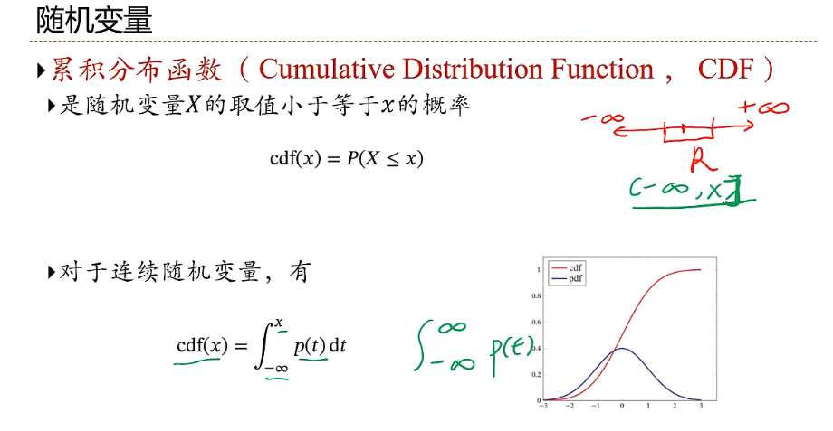
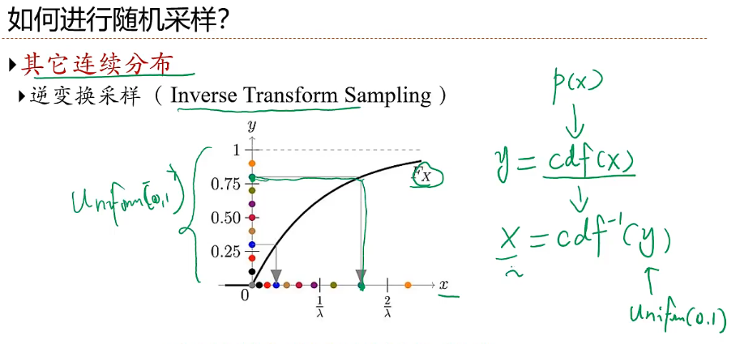
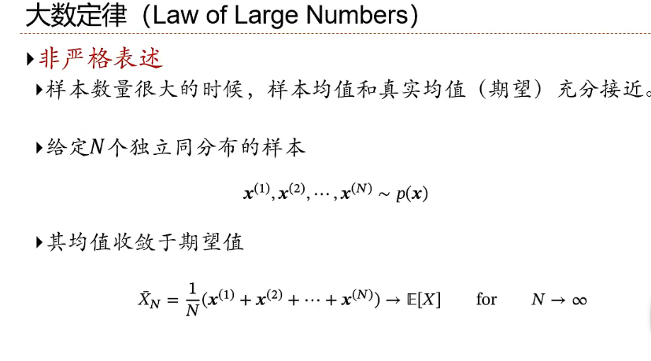
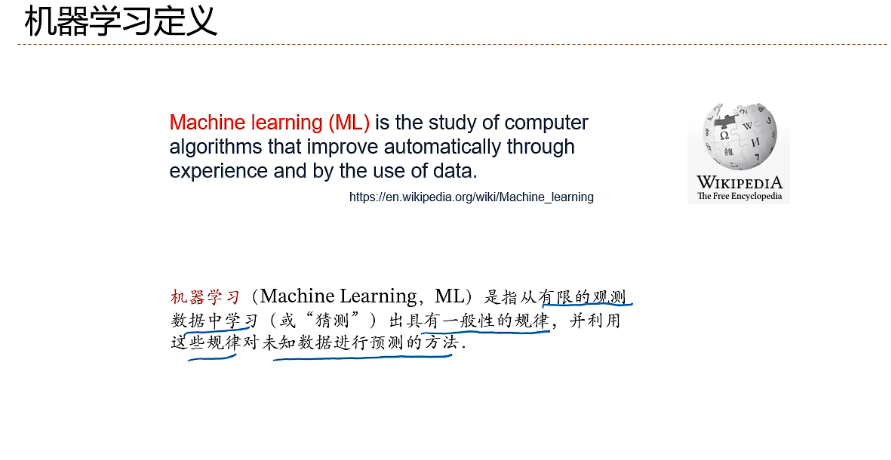

# 机器学习

## 概率的概念

**我们需要从数量的角度来研究随机现象，从而需要在随机试验的可能结果与数之间建立一个对应关系。许多随机试验的一个可能结果是使用一个数来表示的，这样可在试验结果和数之间建立一个自然的恒等映射。**

### **概率的定义**

**随机现象 随机试验 随机事件 随机变量的定义**

- **随机现象**：事前不可预言的现象，即在相同条件下重复进行试验，每次结果未必相同，或知道事物过去的状况，但未来的发展却不能完全肯定。在一定条件下，出现的可能结果不止一个，事前无法确切知道哪一个结果一定会出现，但大量重复试验中其结果又具有统计规律的现象称为随机现象。

  事前不可预言的现象，即在相同条件下重复进行试验，每次结果未必相同，或知道事物过去的状况，但未来的发展却不能完全肯定。例如：以同样的方式抛置硬币却可能出现正面向上也可能出现反面向上；走到某十字路口时，可能正好是红灯，也可能正好是绿灯。

- 试验：试验是对自然和各种社会现象进行的观察和各种科学实验。

  **随机试验**：随机实验是对随机现象进行的观察和科学实验。随机试验有以下特点：

  （1）可以在相同的条件下重复的进行；

  （2）每次试验的可能结果不止一个，并且能事先明确试验的所有可能结果；

  （3）进行一次试验之前不能确定哪一个结果会出现。

  常见的随机试验，如抛掷一枚硬币，落地时是正面还是反面？从不透明的箱子里拿出一个小球，将是什么颜色的？随机试验随处可见，在此不一一列举。

- **随机事件**：随机事件是在随机试验中，可能出现也可能不出现，而在大量重复试验中具有某种规律性的事件叫做随机事件(简称事件)。随机事件通常用大写英文字母A、B、C等表示。**随机试验中的每一个可能出现的试验结果称为这个试验的一个样本点**，记作ωi。全体样本点组成的集合称为这个试验的样本空间，记作Ω．即Ω={ω1，ω2，…，ωn，…}。仅含一个样本点的随机事件称为基本事件，含有多个样本点的随机事件称为复合事件。

  **必然事件**记作Ω，[样本空间](https://baike.baidu.com/item/样本空间/9980386?fromModule=lemma_inlink)Ω也是其自身的一个子集，Ω也是一个“随机”事件，每次试验中必定有Ω中的一个[样本点](https://baike.baidu.com/item/样本点/5577309?fromModule=lemma_inlink)出现，必然发生。

  **[不可能事件](https://baike.baidu.com/item/不可能事件/0?fromModule=lemma_inlink)**记作Φ，[空集](https://baike.baidu.com/item/空集/5016874?fromModule=lemma_inlink)Φ也是样本空间的一个子集，Φ也是一个特殊的“随机”事件，不包含任何样本点，不可能发生。

  在**[随机试验](https://baike.baidu.com/item/随机试验/124845?fromModule=lemma_inlink)**中，随机事件一般是由若干个[基本事件](https://baike.baidu.com/item/基本事件/552306?fromModule=lemma_inlink)组成的。[样本空间](https://baike.baidu.com/item/样本空间/9980386?fromModule=lemma_inlink)Ω的任一子集A称为随机事件。属于事件A的[样本点](https://baike.baidu.com/item/样本点/5577309?fromModule=lemma_inlink)出现，则称事件A发生。

-   **随机变量**：

### 关于概率一些的概念

### **离散型随机变量，利用p(x)表示概率分布**

### **连续随机变量，利用密度函数来描述概率分布**

### **累积分布函数F(x)**

### **随机向量的联合概率分布**

### **条件概率**

 通常指的是 “ t 被定义为m ” 或 “ 根据定义，t 等于m ”(通常在某种条件下)

### 采样（Sampling）

**N个样本，经过统计，服从p(x)分布**

**采样方式：**如何产生服从样本的分布

**更复杂的分布的采样（连续分布）**

### 大数定律

### 凸函数和非凸函数

**凸函数（Convex Function）**和**非凸函数（Non-Convex Function）**在数学优化、经济学、机器学习等领域具有重要意义。理解它们的性质有助于更好地分析和解决各种优化问题。

---

#### **凸函数**

- 在一个向量空间（通常是实数向量空间）中，集合$C$被称为**凸集**，如果对于集合中任意两个点$x, y \in C$和任意的实数$\theta \in [0, 1]$，满足下述条件：

  $θx+(1−θ)y∈C\theta x + (1 - \theta) y \in Cθx+(1−θ)y∈C$

- **直线段**：在二维平面中的一条直线段是凸集，因为连接直线段上任意两点的线段仍然在这条直线上。

- **平面**：二维平面上的一个闭合圆盘是凸集，因为圆盘内任意两点的连接线段仍然在圆盘内部。

- **空间中的球体**：三维空间中的一个球体是凸集，因为球体内部任意两点的连接线段也都在球体内部。

- 表达式 **\($ f: C \rightarrow \mathbb{R}$ \)** 是数学中的一种函数表示法，描述了一个从集合 \( $C $\) 到实数集合 \( $\mathbb{R}$ \) 的函数 \($ f $\)。

在一个实数向量空间中的一个函数$f: C \rightarrow \mathbb{R}$，其中$C$是一个凸集，如果对于任意的$x, y \in C$和任意的$\theta \in [0,1]$，满足以下不等式：

$$
f(\theta x + (1 - \theta) y) \leq \theta f(x) + (1 - \theta) f(y)
$$

则称$f$为**凸函数**。

##### **几何解释**

这个定义意味着，连接函数图像上两点$(x, f(x))$和$(y, f(y))$的线段位于函数图像之上或与其重合。换句话说，函数的图像是“向上凸起”的。

##### **性质**

1. **局部极小即全局极小**：对于凸函数，任何局部最小值也是全局最小值。
2. **次微分**：凸函数在凸集内的每一点都有次微分，这对优化算法非常有用。
3. **凸组合保凸性**：凸函数的非负加权和仍然是凸函数。

##### **示例**

- 二次函数$f(x) = x^2$在$\mathbb{R}$上是凸的。
- 指数函数$f(x) = e^x$也是凸的。

---

#### **非凸函数**

##### **定义**

如果一个函数不满足凸函数的定义，即存在$x, y \in C$和$\theta \in (0,1)$使得：

$$
f(\theta x + (1 - \theta) y) > \theta f(x) + (1 - \theta) f(y)
$$

则称$f$为**非凸函数**。

##### **几何解释**

这意味着存在至少一段，连接函数图像上两点的线段位于函数图像之下，表现为函数图像有“凹陷”或“波动”。

##### **性质**

1. **多重局部极小值**：非凸函数可能有多个局部最小值，这使得优化变得复杂。
2. **优化难度**：由于存在多个局部极值点，找到全局最小值可能非常困难，需要复杂的优化算法。

##### **示例**

- 三次函数$f(x) = x^3 - 3x$在$\mathbb{R}$上是非凸的。
- 正弦函数$f(x) = \sin(x)$也是非凸的。

---

#### **应用与重要性**

- **优化问题**：在优化问题中，目标函数的凸性决定了问题的复杂度。凸优化问题通常更容易解决，有成熟的算法和理论支持。
  
- **机器学习**：许多机器学习模型的损失函数是凸的，如线性回归、逻辑回归，这使得训练过程更稳定和高效。然而，深度学习中的损失函数通常是非凸的，增加了训练的难度。
  
- **经济学**：凸性在消费者和生产者理论中也扮演着重要角色，例如，偏好的凸性反映了消费者对多样性的偏好。

---

**总结**：凸函数具有良好的数学性质，尤其是在优化领域，可以保证局部最小值即为全局最小值，使得求解过程更加简洁明了。而非凸函数虽然更复杂，但在实际应用中也非常常见，需要更加复杂和精巧的算法来处理。

## 机器学习的定义

**机器学习≈自动构建一个映射函数**

**为什么要机器学习:因为现实世界的问题都比较复杂，很难通过规则来手工实现**

**如何构造映射函数**

构造函数空间（函数族$ \mathscr{F} $），不是简单的拟合问题，对于未知的数据（整个数据分布上），误差要达到尽量小

**机器学习的定义**

## 机器学习的类型和要素

## 泛化和正则化

## 线性回归

## 多项式回归

## 线性回归的概率视角

## 模型选择和偏差-方差分解

## 常用定理

