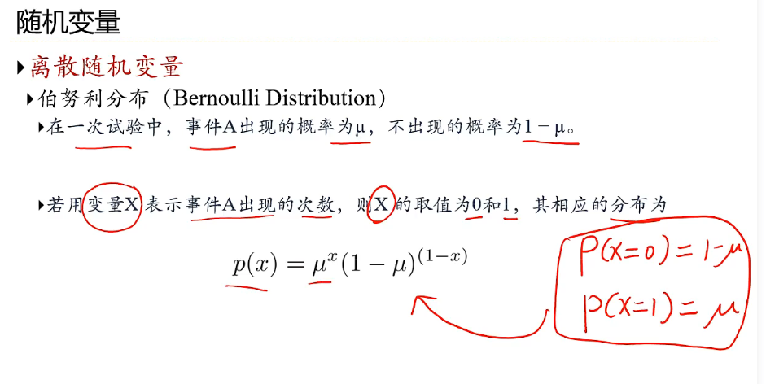

# 机器学习

## 概率的概念

**我们需要从数量的角度来研究随机现象，从而需要在随机试验的可能结果与数之间建立一个对应关系。许多随机试验的一个可能结果是使用一个数来表示的，这样可在试验结果和数之间建立一个自然的恒等映射。**

**离散型随机变量，利用p(x)表示概率分布**

**连续随机变量，利用密度函数来描述概率分布**

**累积分布函数F(x)**

**随机向量的联合概率分布**

**条件概率**

## 机器学习的定义

## 机器学习的类型和要素

## 泛化和正则化

## 线性回归

## 多项式回归

## 线性回归的概率视角

## 模型选择和偏差-方差分解

## 常用定理

