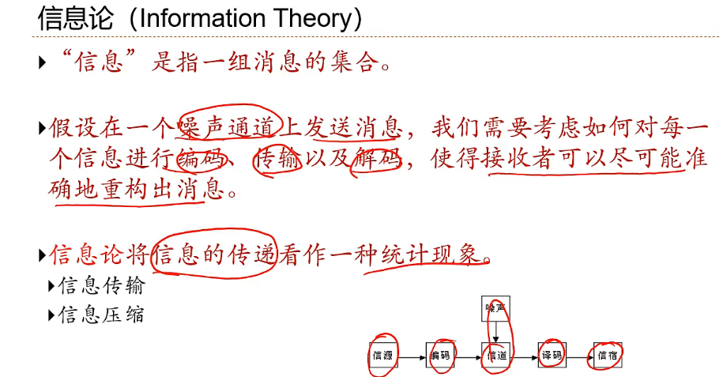
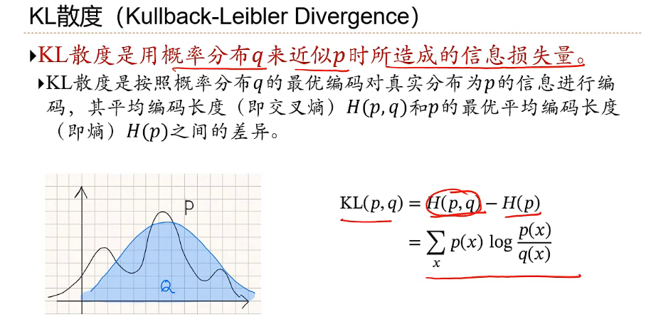
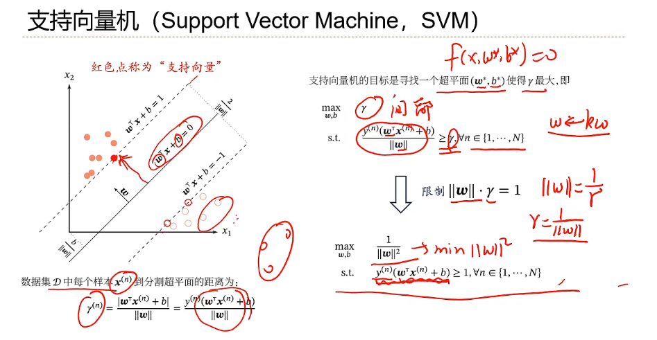

# 线性模型

## 分类问题示例

## 线性分类模型

## 交叉熵与对数似然

### 信息论

### 熵（Entropy）

### 熵编码

### 交叉熵

### KL散度

### 应用到机器学习

==**下面开始分类器**==

## Logistic回归

## Softmax回归

> 主要学习方式，参数化的条件概率和真实的条件概率的交叉熵

**softmax函数**

**softmax回归**

> 学习准则：交叉熵
>
> 优化：梯度下降

## 感知器（Perceptron）

## 支持向量机（SVM）

**几何距离**

**支持向量机**

## 小结
