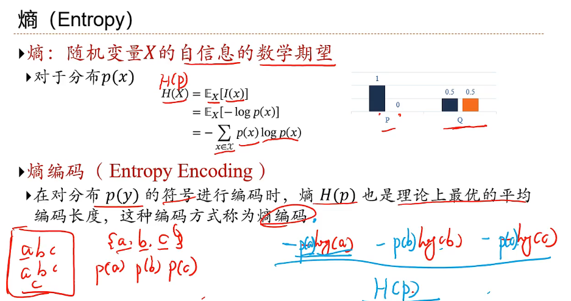
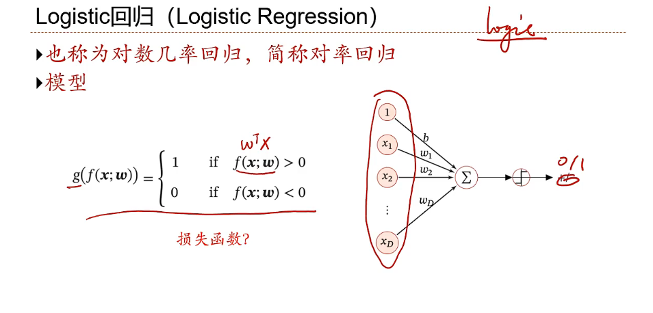
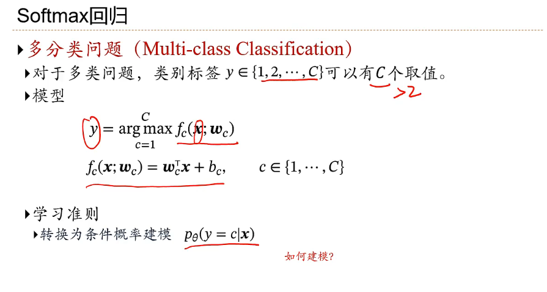
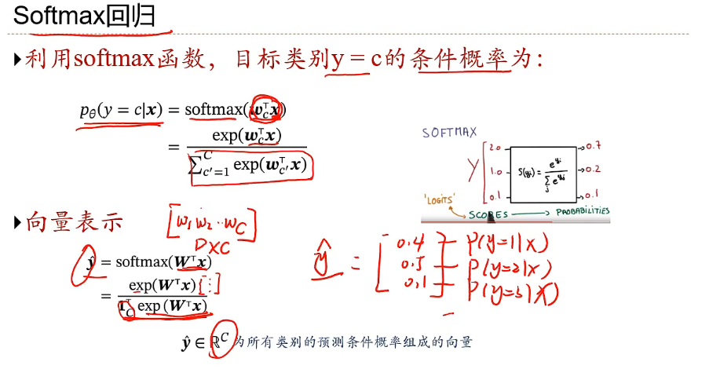
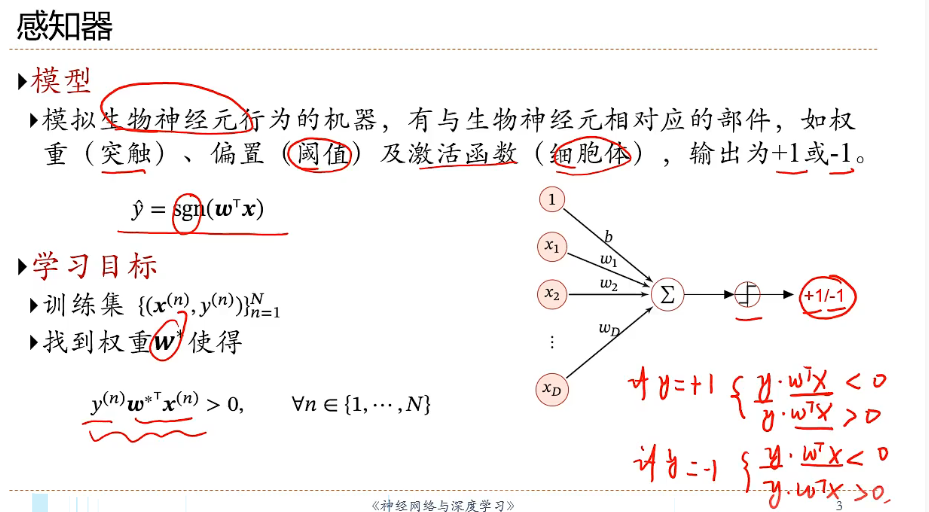
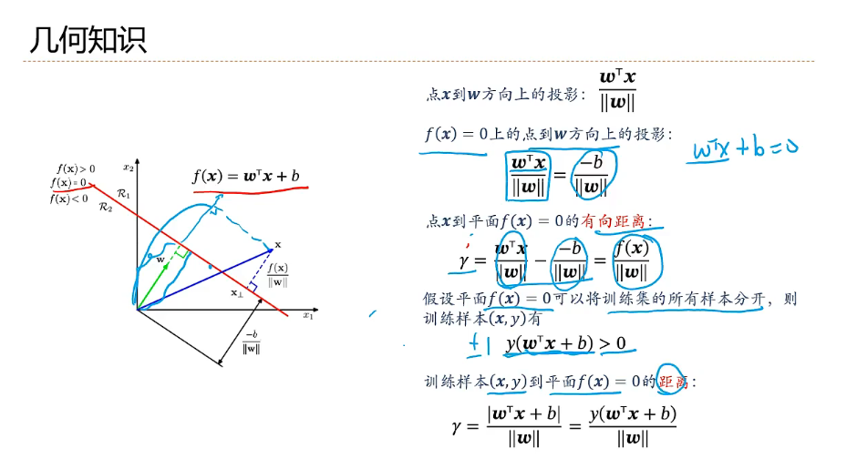
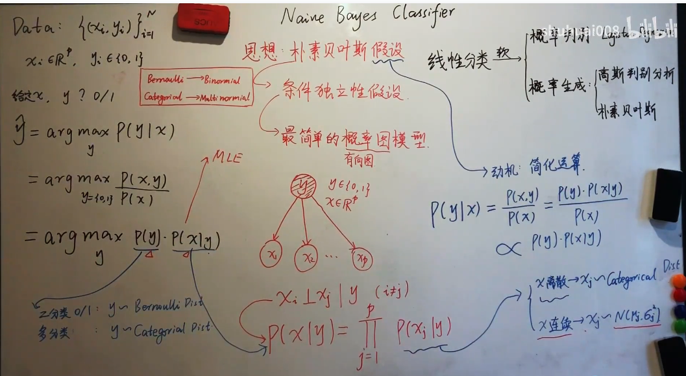

# 线性模型

## 分类问题示例

## 线性分类模型

## 交叉熵与对数似然

### 信息论

### 熵（Entropy）

### 熵编码

### 交叉熵

### KL散度

### 应用到机器学习

==**下面开始具体的分类器**==

## Logistic回归

## Softmax回归

> 主要学习方式，参数化的条件概率和真实的条件概率的交叉熵

**softmax函数**

**softmax回归**

> 学习准则：交叉熵
>
> 优化方法：梯度下降

## 感知器（Perceptron）

## 支持向量机（SVM）

**几何距离**

**支持向量机**

## 朴素贝叶斯分类器

**贝叶斯分类** 是基于贝叶斯定理的一种分类方法，通过计算后验概率来做分类。

**朴素贝叶斯分类器** 是贝叶斯分类的一种简化版本，它假设特征之间条件独立，从而简化了计算。

**贝叶斯估计** 是贝叶斯**推断**的一种应用，侧重于对未知参数的估计，而不是分类。

### 贝叶斯估计

是的，贝叶斯估计通常指的是最大后验估计（MAP, Maximum A Posteriori Estimation）。在贝叶斯框架下，估计参数时，我们结合了先验分布和观察数据得到后验分布。最大后验估计通过最大化后验分布来得到参数的估计值。

具体来说，对于一个给定的观察数据$D$，参数$\theta$的最大后验估计是通过最大化后验分布$P(\theta | D)$得到的。根据贝叶斯公式，后验分布可以表示为：

$
P(\theta | D) = \frac{P(D | \theta)P(\theta)}{P(D)}
$

其中：
- $P(D | \theta)$是似然函数，表示给定参数$\theta$时观测数据$D$的概率。
- $P(\theta)$是先验分布，表示参数$\theta$在没有数据时的分布。
- $P(D)$是数据的边际概率，通常通过优化估计的常数被忽略。

最大后验估计等价于最大化似然函数和先验分布的乘积：

$
\hat{\theta}_{MAP} = \arg \max_{\theta} P(D | \theta)P(\theta)
$

所以，贝叶斯估计就是通过这种方式找到最有可能的参数$\theta$。

如果先验分布$P(\theta)$是均匀分布或者没有先验信息，那么最大后验估计简化为最大似然估计（MLE）。

**==进一步澄清这个区别：==**

**贝叶斯分类 (Bayesian Classification)**

贝叶斯分类的目标是计算后验概率 $P(C | X)$，用来进行分类决策。这里的类别 $C$ 是我们要预测的标签，特征 $X$ 是给定的输入数据。贝叶斯分类并不涉及对模型参数（如 $\theta$）的估计，而是通过贝叶斯定理直接计算后验概率，并基于此来做分类决策。

在贝叶斯分类中，我们有：

$$
P(C | X) = \frac{P(X | C) P(C)}{P(X)}
$$

但是这个过程中，并没有涉及到对某个模型的“参数”进行估计，而是通过样本数据来计算似然 $P(X | C)$ 和先验 $P(C)$ 等。

---

**贝叶斯估计 (Bayesian Estimation)**

也叫贝叶斯推断。

贝叶斯估计涉及到通过观察数据来估计未知的模型参数 $\theta$，并且它需要使用后验分布来进行推断。在贝叶斯估计中，参数 $\theta$ 是模型的一部分，我们通过最大化后验分布来估计这些参数。

贝叶斯公式为：

$$
P(\theta | D) = \frac{P(D | \theta) P(\theta)}{P(D)}
$$

其中：

- $P(D | \theta)$ 是似然函数，表示在给定参数 $\theta$ 下观察到数据 $D$ 的概率。
- $P(\theta)$ 是参数 $\theta$ 的先验分布。
- $P(D)$ 是数据的边际似然（通常作为常数）。

贝叶斯估计的目标通常是通过最大化后验分布 $P(\theta | D)$ 或者计算后验分布的期望来估计参数 $\theta$。

---

### 总结

- **贝叶斯分类** 不涉及直接估计模型的参数 $\theta$，它通过计算后验概率来进行分类，主要关注的是类别 $C$。
- **贝叶斯估计** 则专注于通过数据来估计模型的参数 $\theta$，这种方法在统计建模中尤其常见。

所以，贝叶斯分类可以看作是没有涉及参数 $\theta$ 的分类方法，而贝叶斯估计则明确涉及到对参数 $\theta$ 的推断。

## 高斯判别分析

高斯判别分析（Gaussian Discriminant Analysis, GDA）是一种用于分类问题的统计方法，假设数据服从高斯分布（正态分布），并基于贝叶斯定理进行推理。GDA的目标是学习各个类别的概率分布，并通过这些分布来进行分类。

### 主要假设：
1. **特征条件独立性**：对于每个类别，特征被假设为高斯分布。每个类别的特征向量$x$遵循一个多元高斯分布：
   $$
   p(x | y = k) = \frac{1}{(2\pi)^{d/2} |\Sigma_k|^{1/2}} \exp\left( -\frac{1}{2} (x - \mu_k)^T \Sigma_k^{-1} (x - \mu_k) \right)
   $$
   其中，$\mu_k$是类别$k$的均值向量，$\Sigma_k$是类别$k$的协方差矩阵，$d$是特征的维度。

2. **类别的先验分布**：每个类别的先验概率$p(y=k)$是已知的或可以通过训练数据来估计。

### 分类决策：
根据贝叶斯定理，给定一个观测值$x$，我们可以计算每个类别的后验概率$p(y=k | x)$。然后，选择后验概率最大的类别作为预测类别：
$$
p(y=k | x) \propto p(x | y=k) p(y=k)
$$
最终的决策规则是：
$$
\hat{y} = \arg\max_k \, p(x | y=k) p(y=k)
$$
这相当于选择使得条件概率最大化的类别。

### 主要步骤：
1. **参数估计**：通过训练数据估计每个类别的均值向量$\mu_k$、协方差矩阵$\Sigma_k$和先验概率$p(y=k)$。
2. **分类**：通过计算每个类别的后验概率并选择最大值对应的类别进行分类。

### 优点：
- GDA对数据的分布做了明确假设（数据服从高斯分布），当数据符合这些假设时，表现较好。
- 计算上相对简单，且可以通过协方差矩阵捕捉数据之间的相关性。

### 缺点：
- 当数据不满足高斯分布假设时，GDA的性能可能会大幅下降。
- 对异常值比较敏感。

## 辨析随机变量

对概率的注释有两大学派，一种是频率派另一种是贝叶斯派。后面我们对观测集采用下面记号：

$$
X_{N \times p} = (x_1, x_2, \cdots, x_N)^T, \quad x_i = (x_{i1}, x_{i2}, \cdots, x_{ip})^T
$$

这个记号表示有$N$个样本，每个样本都是$p$维向量。其中每个观测都是由$p(x|\theta)$生成的。

### 频率派的观点

$p(x|\theta)$ 中的 $\theta$ 是一个常量。对于 $N$ 个观测来说，观测集的概率为 $p(X|\theta) = \prod_{i=1}^N p(x_i|\theta)$。

为了求$\theta$的大小，我们采用最大对数似然MLE的方法：
$$
\theta_{MLE} = \arg \max_{\theta} \log p(X|\theta) = \arg \max_{\theta} \sum_{i=1}^N \log p(x_i|\theta)
$$

### 关于独立性：

- **$X$ 之间独立还是 $x$ 之间独立？**

  这里的独立性主要是指观测样本之间的独立性。具体来说，假设每个样本 $x_i$ 是由某个生成模型 $p(x|\theta)$ 生成的。通常，我们假设这些样本之间是**相互独立**的，即对于不同的样本 $x_i$ 和 $x_j$（当 $i \neq j$）来说，它们的联合概率分布是：

  $p(x_1,x_2,…,x_N|\theta) = \prod_{i=1}^N p(x_i|\theta)$

  这意味着观测样本 $x_i$ 之间是独立的。换句话说，你的模型假设不同样本之间不相互影响，而每个样本 $x_i$ 的概率分布仅依赖于其自身的参数 $\theta$。

- **为什么独立性是如此重要？**

  采用独立假设简化了最大似然估计（MLE）的计算，因为它将观测集的联合概率分布转换为单个样本的概率分布的乘积。这使得我们可以将对数似然函数写成：

  $$ \log p(X|\theta) = \sum_{i=1}^N \log p(x_i|\theta) $$

  这样就将求解问题从一个高维的联合概率分布问题，简化为一系列低维的单个样本概率的求和问题。

总结来说，$x_i$（样本之间）是独立的，而 $X$（观测集）的独立性是由这些独立的 $x_i$ 样本组成的。因此，$x_i$ 之间的独立性是关键。
