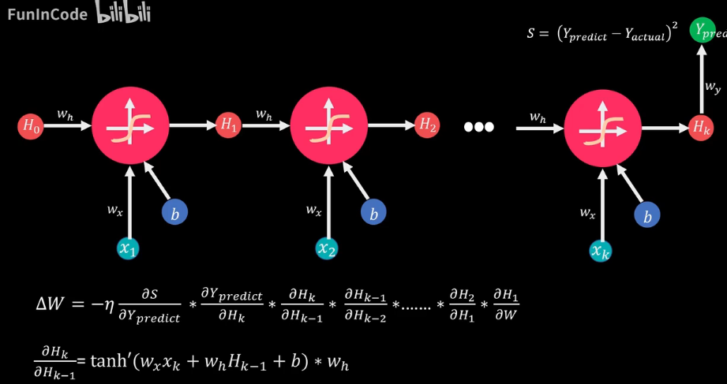

# 循环神经网络

## RNN

### RNN 的基本步骤

1. **输入层**：
   - 输入序列的每个元素在每个时间步都会进入网络。

2. **隐藏层**：
   - RNN 由一个或多个隐藏层构成，每个隐藏层的神经元在每个时间步都会接收前一时间步的隐藏状态和当前时间步的输入。
   - 计算公式为：
   $$
   h_t = f(W_h h_{t-1} + W_x x_t + b)
   $$
   其中 $h_t$ 是当前的隐藏状态，$h_{t-1}$ 是前一时间步的隐藏状态，$x_t$ 是当前输入，$W_h$ 和 $W_x$ 是权重矩阵，$b$ 是偏置，$f$ 是激活函数（如 $\tanh$ 或 ReLU）。

3. **输出层**：
   - 输出层根据当前的隐藏状态生成输出，计算公式为：
   $$
   y_t = W_y h_t + b_y
   $$
   其中 $y_t$ 是当前的输出，$W_y$ 是输出层的权重矩阵，$b_y$ 是输出的偏置。

### 特点

- **时间依赖性**：
  - RNN 能够处理变长的输入序列，适用于时间序列数据和自然语言处理。
  
- **参数共享**：
  - RNN 在每个时间步使用相同的权重矩阵，这使得模型的参数数量大大减少。

### 限制

- **梯度消失和爆炸**：
  - 在处理长序列时，RNN 可能面临梯度消失或梯度爆炸的问题，导致学习效率低下。

### 训练过程

- RNN 通常使用 BPTT 算法进行训练，更新权重以最小化输出与目标之间的误差。

### BPTT

BPTT（Backpropagation Through Time，时间反向传播）是用于训练循环神经网络（RNN）的一种算法。虽然它与传统的反向传播（BP）算法有相似之处，但因为 RNN 的结构具有时间序列特性，所以 BPTT 需要进行特定的处理。

#### BPTT 算法的工作原理

1. **展开 RNN**：
   - 在进行反向传播之前，BPTT 首先将 RNN 展开成一个时间序列的前馈神经网络。例如，对于一个包含 T 个时间步的序列，RNN 会被展开为 T 个相互连接的前馈网络。
  
2. **计算前向传播**：
   - 像传统的 BP 算法一样，首先进行前向传播，计算每个时间步的输出。

3. **计算损失**：
   - 根据模型的输出和目标值计算损失。

4. **反向传播**：
   - 从最后一个时间步开始，将误差反向传播回每个时间步。这意味着需要考虑每个时间步的隐藏状态对输出的影响。

5. **更新权重**：
   - 根据梯度信息更新网络中的所有权重。

#### 为什么采用BPTT

- **时间依赖性**：
  - RNN 的输出不仅依赖于当前输入，还依赖于之前的隐藏状态。这种时间依赖性要求对所有时间步进行反向传播，而不仅仅是当前时间步。
  
- **处理序列数据**：
  - BPTT 设计用于处理变长的序列，因此能够适应序列中信息的动态变化。

#### 总结

BPTT 是 BP 算法的扩展，专门用于处理循环神经网络中的时间序列数据。它通过对每个时间步进行反向传播来捕捉序列中信息的依赖性。

### 梯度下降

## LSTM

