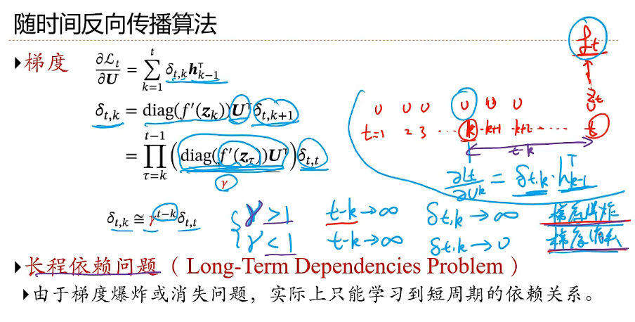

### 应用到机器学习

> 只有最后一个时刻有输出

> 每一时刻都有输入和输出，输入序列和输出序列长度相同。

>AR：自回归模型
>
>具体说，就是用一个变量的时间数列作为因变量数列，用同一变量向过去推移若干期的时间数列作自变量数列，分析一个因变量数列和另一个或多个自变量数列之间的相关关系，建立回归方程进行预测。
>
>再通俗一点讲，就是`用过去时间点的数据预测未来时间点的数据`

### 参数学习

==**长程依赖问题**==

### 解决长程依赖问题