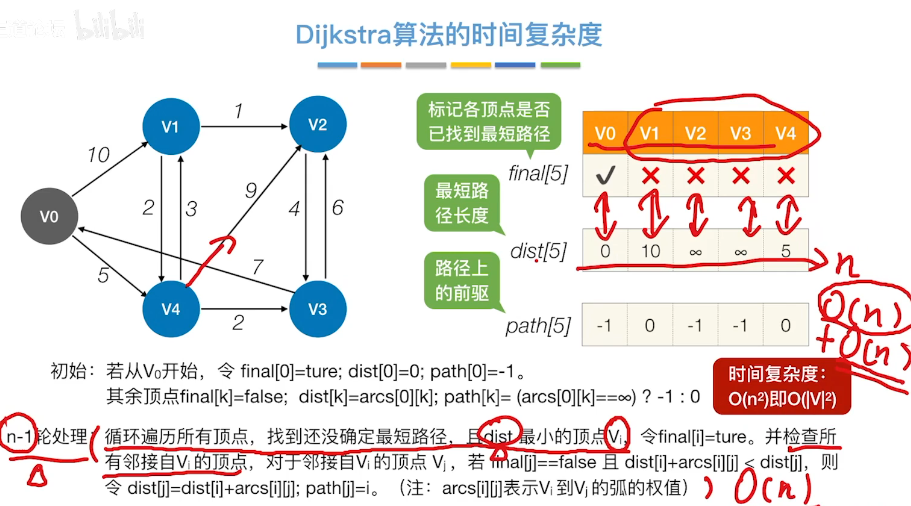

# Dijkstra

给定一个 n 个点 m 条边的有向图，图中可能存在重边和自环，所有边权均为正值。

请你求出 1 号点到 n 号点的最短距离，如果无法从 1 号点走到 n 号点，则输出 −1。



## 用稠密图实现

```c++
#include<iostream>
#include<cstring>
#include<algorithm>

using namespace std;

const int N=5e2+10;
//稠密图
int n,m;
int g[N][N]; //节点i到j的距离

int dist[N]; //点到原点的距离
bool st[N];  //该点到原点的最小距离是否确定

int dijkstra()
{
    memset(dist, 0x3f, sizeof dist);
    dist[1] = 0;

    for (int i = 0; i < n - 1; i ++ )
    {
        int t = -1;
        
        //挑一个离原点最短的点  
        for (int j = 1; j <= n; j ++ )
            if (!st[j] && (t == -1 || dist[t] > dist[j]))
                t = j;
                
              
        //遍历一遍所有点，看以t作为过渡点，是否可以缩短更新遍历点距离原点的距离
        for (int j = 1; j <= n; j ++ )
            dist[j] = min(dist[j], dist[t] + g[t][j]);
        
        
        st[t] = true;
    }

    if (dist[n] == 0x3f3f3f3f) return -1;
    return dist[n];
}

int main(){
    cin>>n>>m;
    memset(g,0x3f,sizeof(g));
    for(int i=0;i<m;i++){
        int a,b,c;
        cin>>a>>b>>c;
        
        g[a][b]=min(g[a][b],c);
    }
    
    cout<<dijkstra();
    
}
```

## 用链式向量法实现(适合稀疏图）

```cpp
#include<iostream>
#include<algorithm>
#include<queue>
#include<cstring>

using namespace std;

const int N= 1e6+10;

int e[N],ne[N],h[N],idx,w[N];
int n,m;
typedef pair<int,int> PII;
int dist[N];
int st[N];

void add(int a,int b,int c){
    w[idx]=c;
    e[idx]=b;
    ne[idx]=h[a];
    h[a]=idx++;
}

int dijkstra(){
    memset(dist,0x3f,sizeof(dist));
    dist[1]=0;
    priority_queue<PII, vector<PII>, greater<PII>> heap;
    heap.push({0, 1});
    //存储的是距离和点
    //利用优先队列按照pair的比较函数按照first比较
    
    while(heap.size()){
        auto t=heap.top();
        heap.pop();
        int ver=t.second;
        int distance=t.first;
        if (st[ver]) continue;
        st[ver] = true;
        for (int i = h[ver]; i != -1; i = ne[i]){
            //遍历连接该点的所有点，不遍历所有的点，根据该点更新连接点的最小距离
            int j = e[i];
            if (dist[j] > dist[ver] + w[i])
            {
                dist[j] = dist[ver] + w[i];
                heap.push({dist[j], j});
            }
        }
    }
    
    if (dist[n] == 0x3f3f3f3f) return -1;
    return dist[n];
    
}

int main(){
    
    cin>>n>>m;
    
    memset(h,-1,sizeof(h));
    
    for(int i=0;i<m;i++){
        int a,b,c;
        cin>>a>>b>>c;
        add(a,b,c);
    }
    
    
    
    cout<<dijkstra()<<endl;
    
    return 0;
}
```

